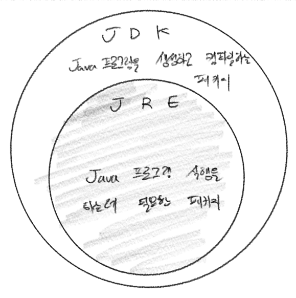

# 1주차 과제: JVM은 무엇이며 자바 코드는 어떻게 실행하는 것인가.

# 목표

자바 소스 파일(.java)을 JVM으로 실행하는 과정 이해하기.

# 학습할 것

* JVM이란 무엇인가
* JVM 구성 요소
* 컴파일 하는 방법
* 바이트코드란 무엇인가
* JIT 컴파일러란 무엇이며 어떻게 동작하는지
* JDK와 JRE 차이
* javac 옵션 조사

# JVM이란 무엇인가

JVM: Java Virtual Machine

자바 가상 머신을 규정한 명세서<sup>보통 VM 스펙이라고 함</sup>에 따르면 JVM은 스택 기반의 해석 머신.<br/>
레지스터<sup>물리적 CPU 하드웨어</sup>는 없지만 일부 결과를 실행 스택에 보관하며, 이 스택의 맨 위에 쌓인 값(들)을 가져와서 계산함.

출처 : [자바 최적화](https://www.aladin.co.kr/shop/wproduct.aspx?ItemId=189618189)

JVM을 사용하면 Java로 작성 된 프로그램을 해석해서, 대상 운영체제에서 실행 가능한 형식의 코드로 변환하여 동작하게 함.<br/>
Java로 작성한 프로그램을 플랫폼에 의존하지 않고 동작하게 하려면 JVM 위에서 Java를 실행하는 것이 필수가 된다.

출처 : [【Java入門】JVMとは？わかりやすく解説！](https://www.sejuku.net/blog/19871)


위 그림을 보면 Java로 작성 된 프로그램은 OS가 아닌 JVM과 상호작용을 하기 때문에 OS 별로 뭔가 특별한 동작을 취하지 않아도 됨.<br/>

### Java 이외의 언어에선?

Java 이외의 컴파일 언어, 예를 들자면 C나 C++ 같은 언어로 작성 된 프로그램은 소스코드를 컴파일 해서 컴퓨터가 이해할 수 있는 <strong>기계어</strong>로 변역함.<br/>
이 때, C나 C++용 컴파일러는 Windows 환경에서는 [Windows용 기계어]로, Linux 환경에서는 [Linux용 기계어] 등으로, 각각 플랫폼에 맞춰서 컴파일 함.


---

# JVM 구성 요소


JVM 구성 요소는 다음과 같음.

* 클래스 로더
* 런타임 데이터 영역(RDA)
* 실행 엔진
* 네이티브 인터페이스

### 클래스 로더

> 컴파일 결과로 만들어진 .class 바이트코드 파일을 읽어들여 메모리에 배치

클래스 로딩, 링크, 초기화 순으로 진행됨.

* 로딩 : 클래스를 읽어오는 과정
* 링크 : 레퍼런스 연결 과정
* 초기화 : static 값 초기화하고 변수 할당하는 과정

### 런타임 데이터 영역(RDA)

> JVM이 프롤그램을 수행하기 위해 OS로부터 별도로 할당받은 메모리 영역


위의 그림처럼 RDA에는

* PC Registers
* JVM Stacks
* Method Area
* Heap
* Native Method Stack

으로 구성됨. 그중에서도 PC Registers, JVM Stacks, Native Method Stack 은 각 쓰레드 별로 존재.

#### PC Registers

> 현재 수행중인 JVM 명령의 주소를 갖는다.

#### Method Area

> 모든 스레드들이 공유하는 메모리 영역. Class, Method, Field 정보를 가짐.

* Type Information : 클래스와 관련 된 모든 정보
* Constant Pool : 문자열 상수와 같은 리터럴 상수
* Field Information
* Method Information
* Class Variable : static으로 선언되는 모든 클래스 변수
* Reference to Class Class Loader: 특정 클래스를 로드한 클래스로더의 정보를 관리
* Reference to Class class method table: 클래스 메서드에 대한 direct reference

[참조](https://smjeon.dev/etc/jvm-rda/)

#### JVM Stack


각각 쓰레드가 시작될 때 생성됨. 메서드가 수행될 때 마다 스택 프레임이 생성되어 해당 쓰레드의 JVM stack에 추가됨.
메서드가 종료되면 스택 프레임이 종료됨.

#### Native Method Stack

> 자바 외의 언어로 작성된 네이티브 코드를 위한 스택.
> JNI<sup>Java Native Interface</sup>를 통해 호출하는 C/C++코드를 수행하기 위한 스택.

#### JVM Heap

> JVM은 Heap에서 자바 프로그램을 실행할 때 자바 클래스 인스턴스와 Array에 대한 메모리를 관리함.


Heap과 Method Area는 각각의 쓰레드가 메모리를 공유하는 구조. Method Area는 변하지 않는 상수 값들이 존재하기 때문에 쓰레드들이 메모리를 공유하더라도 문제 없음.

Heap은 Garbage Collection의 대상.


---

# 컴파일 하는 방법

1. vi 에디터를 이용하여 hello.java 파일 작성

```shell
vi hello.java
```

2. hello.java 파일에는 다음과 같은 내용 작성

```java
class Hello {
    public static void main(String[] args) {
        System.out.println("Hello Java");
    }
}
```

3. javac 명령어를 이용하여 작성한 hello.java를 컴파일

```shell
javac hello.java
```

4. java 명령어를 이용하여 javac 명령어로 생성 된 Hello.class 파일 실행

```shell
java Hello
```

---

# 바이트코드란 무엇인가

> Java 가상 머신<sup>JVM</sup>에서 실행하기 위해서 만들어지는 <b>중간 코드</b>

바이트코드는 컴퓨터가 직접 이해할 수 있는 기계어가 아님.(주의)<br/>
단지 JVM에서 프로그램을 실행하기 위한 중간 언어.

---

# JIT 컴파일러란 무엇이며 어떻게 동작하는지

> JIT<sup>Just In Time</sup> 컴파일러는 런타임 시에 환경에 의존하지 않는 중간코드를 기계어로 컴파일 하기 위한 것

대략적으로 말하자면 다음과 같은 흐름
> 소스코드 -> 컴파일 -> 중간코드 -> 실행(컴파일)


JVM언어는 컴파일을 실행시킬 때, 모든 소스코드를 컴파일 하는 것이 아님. <br/>
우선, 중간코드를 작성함（java bytecode). 이 중간코드를 작성하는 프로세스가 추가된 덕분에, JVM환경만 갖췄다면, 어떤 OS라도 같은 코드를 실행하는 것이 가능.

그 후에, 작성된 중간코드를 한번에 컴파일 하지 않는다. 인터프리터로 소스코드를 실행할 때마다 컴파일 하고 있다.

이유는 다음과 같음.

1. 컴파일해도 그 코드가 한번밖에 사용되지 않는다면 컴파일 자체가 헛된 작업이 됨.
    - 컴파일에는 시간이 걸리기 때문에 한번만 호출되는 코드는 인터프리터로 실행하는 편이 실행까지 걸리는 시간이 더 단축될 수 있다.
    - 반대로, 빈번하게 호출되는 코드는, 컴파일 된 코드가 더 빠르게 실행될 수 있기 때문에, 컴파일을 해야 한다.

2. 컴파일할 때마다 이용 가능한 정보를 모을 수 있다.
    - 컴파일 할 때에 필요한 정보를, 인터프리터에서 실행할 때에 얻는 것이 가능하다.
    - 이렇게 얻은 정보를 이용하여, 컴파일 시점에 다양한 최적화를 수해앟는 것이 가능하다.

### JIT 컴파일러의 세 가지 유형

> JIT 컴파일러에는 3종류의 컴파일러가 존재함.
> java8 부터는 layered 컴파일러가 디폴트

1. 클라이언트 컴파일러
    - 서버 컴파일러보다 먼저 컴파일 시작.
    - 최적화를 위한 대기시간이 짧음.
    - Start-Up 시간이 빠름. 하지만 최적화가 덜하기 때문에 코드실행은 서버가 더 빠름.
2. 서버 컴파일러
    - 컴파일전에 많은 정보를 수집하여 최적화에 중점을 둠.
    - 서버 컴파일러는 절대로 모든 코드를 컴파일하지 않음.
3. 계층적 컴파일러
    - 클라이언트 컴파일러와 서버 컴파일러를 정리한 것.
    - 초기단계에서는 클라이언트 컴파일러로 컴파일되고, 최적화를 위한 정보가 모이면 서버 컴파일러로 컴파일 됨.

[참조1](https://m.blog.naver.com/PostView.naver?isHttpsRedirect=true&blogId=kbh3983&logNo=220985785358)
[참조2](https://qiita.com/kinshotomoya/items/c66954aee31f06db99a0)

# JDK와 JRE의 차이

JRE<sup>Java Runtime Environment</sup>
---
JRE는 이름에서 보이는것과 같이 환경. JVM<sup>Java Virtual Machine</sup>, Java Class Library, JAva Command 등등
컴파일된 Java 프로그램을 실행하는데 필요한 패키지.

JDK<sup>Java Development Kit</sup>
---
JDK는 Java를 사용하기 위해 필요한 모든 기능을 갖춘 Java용 SDK<sup>Software Development Kit</sup>임.<br/>
JRE를 비롯한 컴파일러같은 <strong>프로그램을 생성하고 컴파일</strong>할 수 있는 도구임.



[참조](https://developerntraveler.tistory.com/49)

# javac 옵션 조사

javac란?
---
> 자바 컴파일러로써, 자바코드를 작성한 소스파일(.java)을 자바 가상머신이 인식할 수 있는 바이트코드(.class)타입으로 변환시켜주는 명령어

옵션
---

### -classpath

> 컴파일러가 컴파일 하기 위해 필요로 하는 참조할 클래스 파일들을 찾기 위해서 컴파일 시 파일 경로를 지정해주는 옵션.

예를 들어 Hello.java 파일이 `~/twosom` 디렉토리 안에 존재하고, 필요한 다른 클래스들이 `~/twosom/classes` 폴더 안에 위치한다면

```shell
javac -classpath ~/twosom/classes ~/twosom/classes/Hello.java
```

로 실행하면 된다.

### -d

> 클래스 파일을 생성할 루트 디렉토리

기본적으로 컴파일러는 -d 옵션을 주지 않으면, 소스파일이 위치한 디렉토리에 클래스 파일을 생성함.

### -encoding

> 소스 파일에 사용될 문자열 인코딩을 설정함.

만약 encoding 옵션을 주지 않은 경우에는, 플랫폼의 기본적인 컨버터가 사용되어짐.

그 외의 옵션들은 [여기](https://starplaying.tistory.com/289)에서 확인 가능