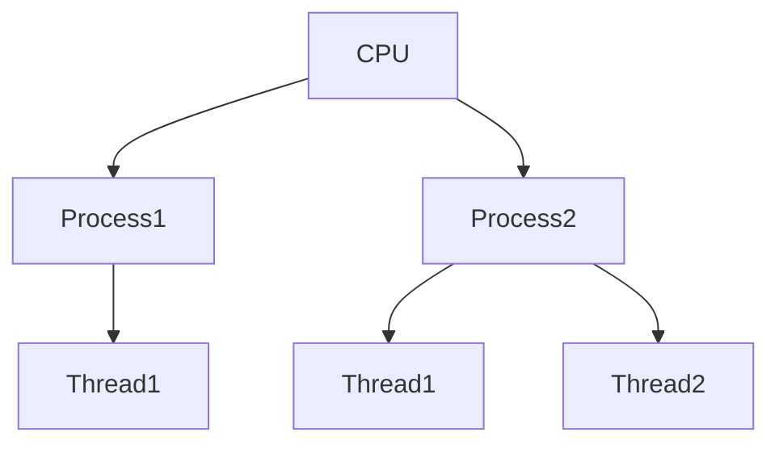
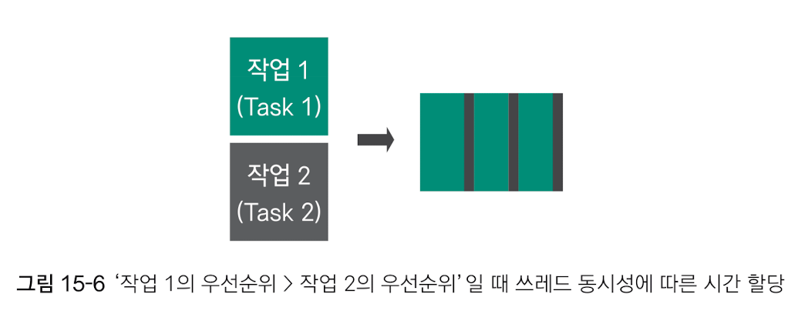

# 10주차 과제: 멀티쓰레드 프로그래밍

# 목표

자바의 멀티쓰레드 프로그래밍에 대해 학습하세요.

# 학습할 것 (필수)

* Thread 클래스와 Runnable 인터페이스
* 쓰레드의 상태
* 쓰레드의 우선순위
* Main 쓰레드
* 동기화
* 데드락

# Thread 클래스와 Runnable 인터페이스

## Thread

> 중앙 처리 장치를 사용하는 최소 단위

Thread를 이해하기 위해서는 Process를 이해할 필요가 있다.

### Process

> 메모리상에 로딩된 프로그램

메모리는 프로그램 전체를 한꺼번에 로딩하는것이 아니라 그때그때 필요한 부분을 동적으로 로딩.<br/>
동일한 프로그램을 메모리에 2번 로딩하면 2개의 프로세스가 동작. -> 멀티 프로세스라 지칭.

문제는 CPU의 속도 차이 이슈로 인해 메모리의 프로세스와만 대화하는 것. `=` 프로세스만 CPU를 사용할 수 있는 것.<br/>

---
하지만 실제 CPU를 사용하는 것은 프로세스 내부의 쓰레드. 바꿔 말하면 쓰레드가 없는 프로세스는 존재할 수 없음.
고로, 쓰레드를 정리하자면 다음과 같다.
> CPU를 사용하는 최소 단위



## Runnable 인터페이스

Runnable 인터페이스를 알아보려면 먼저 Thread 생성 방법을 알아봐야 함

### Thread 생성 방법

1. `Thread` 클래스를 상속받아 `run()` 메소드 재정의 하는 방법
    1. `Thread` 클래스를 상속 받아 `run()` 메소드 재정의 (혹은 경우에 따라서는 익명 클래스)
    2. 해당 객체 생성
    3. `start()` 메소드를 이용해 쓰레드 실행


2. `Runnable` 인터페이스를 구현한 객체를 생성하는 방법
    1. `Runnable` 인터페이스 구현한 클래스에 추상 메소드 `run()` 구현
    2. `Thread` 객체 생성 시에 인자로 앞서 구현한 `Runnable` 인터페이스 구현체 객체를 생성자 매개변수로 전달.
    3. `start()` 메소드를 이용해 쓰레드 실행

# 쓰레드의 상태

> 쓰레드는 여느 객체처럼 생명주기를 지닌다. 각 생명주기마다 다양한 상태를 가지는데,
> 이 상태를 `Thread.State` 타입을 반환하는 `getState()` 메소드로 가져올 수 있다.

쓰레드의 각 상태들은 다음과 같음.

### NEW

처음 객체가 생성될 때의 상태.

### RUNNABLE

쓰레드 객체가 생성된 후 `start()` 메소드로 실행되고 있는 상태.

### BLOCKED

`동기화 메소드` 또는 `동기화 블록`을 실행하기 위해 먼저 실행 중인 쓰레드의 실행 완료를 기다리는 상태.

### WAITING

시간 정보가 없는 `join()` 메소드가 호출되거나 `wait()` 메소드가 호출된 경우의 상태.

### TIME_WAITING

정적 메소드 `Thread.sleep(millis: long)` 또는 인트선스 메소드 `join(millis: long)`이 호출 된 경우의 상태.

### TERMINATED

종료된 쓰레드인 상태.

# 쓰레드의 우선순위

> 모든 쓰레드는 우선순위값을 지님.
> 이 우선순위값은 1~10까지의 범위를 가지며 높을 수록 우선순위가 높은 값.

쓰레드의 우선순위는 쓰레드의 동시성과 관계가 있음. 쓰레드 병렬성일 경우에는 의미가 없음.

2개의 작업이 하나의 CPU 코어에서 동작할 때 쓰레드 동시성에 따라 2개의 작업은 일정 시간 간격으로 번갈아가며 실행됨.

대략 우선순위가 높으면 상대적으로 더 많은 시간을 할당받는 구조.



# Main 쓰레드

> `public static void main(String[] args){...}` 구문안에 들어가는 모든 코드들이
> 메인 스레드 상에서 실행되는 것.

// 발표 시 Swift Combine 에서의 쓰레드 관리 소개하기

# 동기화

> 하나의 작업이 완전히 완료된 후 다른 작업을 수행하는 것.

동기화 방법은 크게 두가지로 나눌 수 있음.

* 메소드 동기화
* 블록 동기화

메소드 동기화
--
동기화하고자 하는 리턴 타입 앞에 `synchronized` 키워드를 붙이면 됨.

```java
public class SomeClass {
    public synchronized void someSyncMethod() {
       ...
    }
}
```

블록 동기화
--
멀티 쓰레드 프로그램에서도 동기화 영역에서는 하나의 쓰레드만 실행할 수 있기 때문에 많은 성능 손실이 발생.<br/>
따라서 동기화 영역은 꼭 필요한 부분에만 적용하는 것이 베스트.

메소드 전체 중에 동기화가 필요한 부분이 일부라면 해당 부분만 동기화 하는 방식을 `블록 동기화`라고 함.

```java
public class SomeClass {
    public void someBlockSyncMethod() {
        synchronized (this) {
           ...
        }
    }
}
```

`synchronized (this)` 라고 한 부분에는 어떤 객체도 올 수 있다.
일반적으로는 `this`를 넣어 자기 객체를 가리킨다.

Key 객체
--
모든 객체는 자신만의 열쇠를 하나씩 갖고 있음.
위의 블록 동기화 코드를 보면 **해당 블록이 `this` 객체가 갖고 있는 열쇠로 잠김.**

블록 동기화의 소괄호 안에는 어떤 객체가 와도 무방. But, 메소드 동기화 코드는 `this` 객체의 열쇠만을 사용.<br/>
따라서 아래와 같은 경우에는 모든 메소드가 `this` 열쇠로 잠겨 있기 때문에 한개 쓰레드가 어떤 메소드 한개를 실행중에 있다면
나머지 메소드들도 똑같은 Key 객체로 잠겨있기 때문에 사용할 수 없게 된다.

```java
public class SomeClass {

    // 해당 메소드는 this 객체의 열쇠를 사용
    public synchronized void method1() {
       ...
    }

    // 해당 메소드 또한 this 객체의 열쇠를 사용
    public synchronized void method2() {
       ...
    }

    // 해당 메소드 또한 this 객체의 열쇠를 사용
    public synchronized void method() {
       ...
    }
}
```

# 데드락

> 두 개의 쓰레드에서 서로가 가지고 있는 락이 해제되기를 무한정 기다리고 있는 상태. (욕심쟁이)

## 발생 조건

* 상호 배제 : 한 자원에 대해 여러 쓰레드 동시 접근 불가
* 점유와 대기 : 자원을 가지고 있는 상태에서 다른 쓰레드가 사용하고 있는 자원 반납을 기다리는 것
* 비선점 : 다른 쓰레드의 자원을 실행 중간에 가져올 수 없음
* 환형대기 : 각 쓰레드가 순환적으로 다음 쓰레드가 요구하는 자원을 가지고 있는 것

위 4가지 중에 한가지라도 만족하지 못한다면 데드락을 해결할 수 있음.