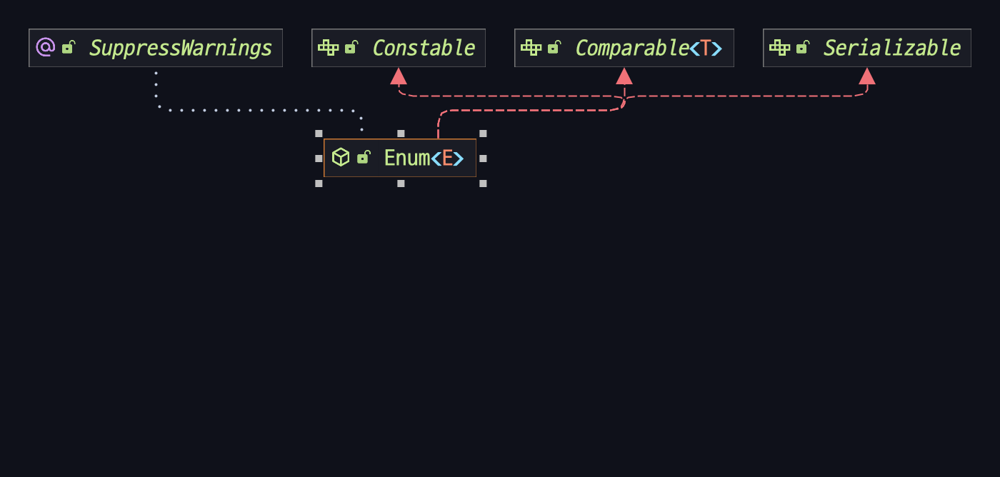
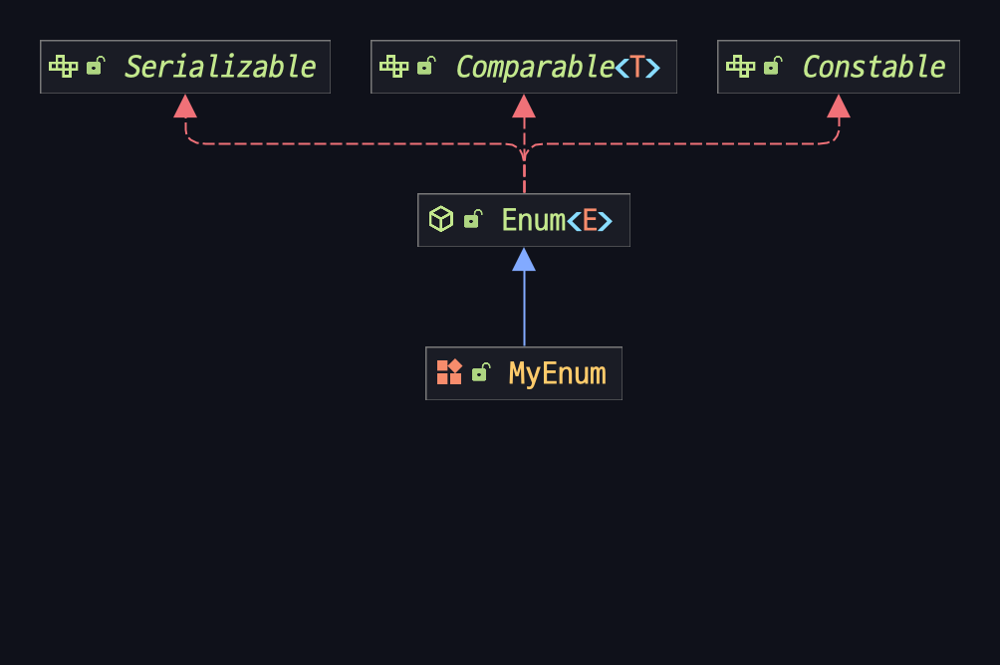
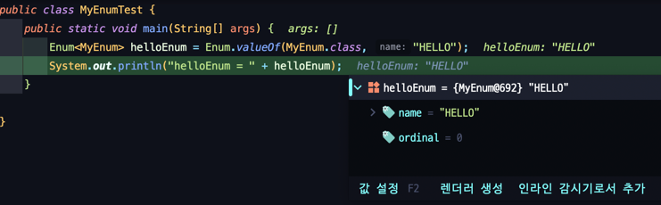

# 11주차 과제: Enum

# 목표

자바의 열거형에 대해 학습하세요.

# 학습할 것 (필수)

* enum 정의하는 방법
* enum이 제공하는 메소드 (`values()`와 `valueOf()`)
* `java.lang.Enum`
* EnumSet

# enum 정의하는 방법

enum이 뭔데?
--
> 사전적 정의
> --
> e·nu·mer·a·tion<br/>
> (하나하나) 셈, 계산, 열거2. 목록, 일람표

그래서 어디에 쓰는데?
--
enum을 어디에서 쓰는지 알아보기 이전에 과거에는 경우의 수가 제한된 상징적인 값에 숫자를 할당하여 정수형으로 표현하는 방법을 많이 사용했었다.<br/>
그냥 정수만 띡~ 하고 표현하는 것이 아니라 상수에 할당하여 해당 상수명에 의미를 부여해서 사용하였다.

```java
public class JavaTest {
    public static void main(String[] args) {
        final int EAST = 1;
        final int WEST = 2;
        final int SOUTH = 3;
        final int NORTH = 4;

        int origin = EAST;
        origin = SOUTH;
        if (origin == WEST) {
        }  // 서쪽이면
        if (origin != NORTH) {
        }  // 북쪽이 아니면
    }
}
```

위 코드에서 상수 네 개를 대문자로 정의했는데, 각 방향의 영어 단어로 상수를 정의함으로써 어느 누가 봐도 코드가 읽기 쉽고 무슨 뜻인지 바로 알 수 있게 된다.<br/>
이 방법은 실제로 과거 오랫동안 사용해왔던 방식이지만 다음과 같은 문제가 있다.

* 상수를 정수 타입으로 정의했으므로 정수가 출력됨.
* 범위를 벗어나느 값을 대입해도 컴파일 에러가 발생하지 않는다.
* 정숫값으로 비교하므로 의미가 다른 값도 같은 값으로 인식한다.

---
위의 문제를 타파하고자 JDK 1.5 버전부터 enum(열거형) 타입을 새로 도입했다.(~~그러나 대부분의 언어가 이미 지원하고 있었다... 자바만 특히 늦었을 뿐..~~)

그래서 어떻게 사용하는데?
---
> enum Direction { EAST, WEST, SOUTH, NORTH }

이렇게 `enum` 이라는 키워드로 선언한 후 안에 열거타입 값들을 정의한다.<br/>
enum은 항상 싱글톤이기 때문에 `Direction direction = new Direction(Direction.EAST)` 처럼 선언할 필요가 없다.

그냥 `Direction direction = Direction.EAST` 로 끝이다.
---

# enum이 제공하는 메소드(`values()`와 `valueOf()`)

enum에도 메소드가 있다고?
---
enum에도 물론 기본적으로 메소드를 제공한다. 그 중 `values()` 라는 메소드는 **해당 enum의 모든 상수를 선언한 순서대로 배열로 만들어 리턴한다.**
해당 메소드는 열거 생수의 목록을 사용자에게 보여주거나 할 때 사용할 수 있겠다.

또한, `valueOf()` 라는 메소드는 문자열로 된 열거 상수 이름을 받아 해당하는 열거 상숫값을 리턴한다.
사용자가 직접 입력한 문자열 혹은 Database 같은 곳에서 값을 불러와서 열거 상수를 반환할 때 사용할 수 있겠다.

---

# `java.lang.Enum`

Enum 클래스는 enum에서 사용하는 메소드들이 정의된 클래스이다.
상속계층도를 보면 다음과 같다.


실제로 다음과 같은 enum을 생성한 후 바이트코드로 변환하면 다음과 같다.

<sub>바이트코드 변환 전</sub>
```java
public enum MyEnum {
    HELLO,
    WORLD
}
```

<sub>바이트코드 변환 후</sub>
```java
// class version 61.0 (61)
// access flags 0x4031
// signature Ljava/lang/Enum<LMyEnum;>;
// declaration: MyEnum extends java.lang.Enum<MyEnum>
public final enum MyEnum extends java/lang/Enum {

  // compiled from: MyEnum.java

  // access flags 0x4019
  public final static enum LMyEnum; HELLO

  // access flags 0x4019
  public final static enum LMyEnum; WORLD

  // access flags 0x101A
  private final static synthetic [LMyEnum; $VALUES

  // access flags 0x9
  public static values()[LMyEnum;
   L0
    LINENUMBER 1 L0
    GETSTATIC MyEnum.$VALUES : [LMyEnum;
    INVOKEVIRTUAL [LMyEnum;.clone ()Ljava/lang/Object;
    CHECKCAST [LMyEnum;
    ARETURN
    MAXSTACK = 1
    MAXLOCALS = 0

  // access flags 0x9
  public static valueOf(Ljava/lang/String;)LMyEnum;
   L0
    LINENUMBER 1 L0
    LDC LMyEnum;.class
    ALOAD 0
    INVOKESTATIC java/lang/Enum.valueOf (Ljava/lang/Class;Ljava/lang/String;)Ljava/lang/Enum;
    CHECKCAST MyEnum
    ARETURN
   L1
    LOCALVARIABLE name Ljava/lang/String; L0 L1 0
    MAXSTACK = 2
    MAXLOCALS = 1

  // access flags 0x2
  // signature ()V
  // declaration: void <init>()
  private <init>(Ljava/lang/String;I)V
   L0
    LINENUMBER 1 L0
    ALOAD 0
    ALOAD 1
    ILOAD 2
    INVOKESPECIAL java/lang/Enum.<init> (Ljava/lang/String;I)V
    RETURN
   L1
    LOCALVARIABLE this LMyEnum; L0 L1 0
    MAXSTACK = 3
    MAXLOCALS = 3

  // access flags 0x100A
  private static synthetic $values()[LMyEnum;
   L0
    LINENUMBER 1 L0
    ICONST_2
    ANEWARRAY MyEnum
    DUP
    ICONST_0
    GETSTATIC MyEnum.HELLO : LMyEnum;
    AASTORE
    DUP
    ICONST_1
    GETSTATIC MyEnum.WORLD : LMyEnum;
    AASTORE
    ARETURN
    MAXSTACK = 4
    MAXLOCALS = 0

  // access flags 0x8
  static <clinit>()V
   L0
    LINENUMBER 2 L0
    NEW MyEnum
    DUP
    LDC "HELLO"
    ICONST_0
    INVOKESPECIAL MyEnum.<init> (Ljava/lang/String;I)V
    PUTSTATIC MyEnum.HELLO : LMyEnum;
   L1
    LINENUMBER 3 L1
    NEW MyEnum
    DUP
    LDC "WORLD"
    ICONST_1
    INVOKESPECIAL MyEnum.<init> (Ljava/lang/String;I)V
    PUTSTATIC MyEnum.WORLD : LMyEnum;
   L2
    LINENUMBER 1 L2
    INVOKESTATIC MyEnum.$values ()[LMyEnum;
    PUTSTATIC MyEnum.$VALUES : [LMyEnum;
    RETURN
    MAXSTACK = 4
    MAXLOCALS = 0
}

```

바이트코드를 보면 알겠지만 `MyEnum`이라는 `enum` 객체가 `java.lang.Enum<MyEnum>` 을 확장하고 있다는 사실이 상단의 주석에 나타나있다.<br/>
실제로 `MyEnum` 객체는 다음과 같은 상속 구성을 가진다.



또한 MyEnum 값을 `Enum` 클래스의 정적 메소드로 이런 식으로 가져오는 것도 가능하다.
```java
public class MyEnumTest {
    public static void main(String[] args) {
        Enum<MyEnum> helloEnum = Enum.valueOf(MyEnum.class, "HELLO");
        System.out.println("helloEnum = " + helloEnum);
    }
}
```



# `EnumSet`

> enum에 사용하기 위한 특수한 Set 구현체이다. 

요소의 갯수가 2<sup>6</sup>을 넘어가지 않을 경우 long 형의 데이터 필드를 사용한다는데,,, 이렇게 세부적인 스펙들은 넘어가고 이런 클래스를 왜 쓰냐~!!

**겉으로는 Set을 기반으로 한지만 내부적으로는 비트필드를 사용하기 때문에 메모리 공간 사용량은 ⬇️ 속도는 ⬆️!**


그 이외에 스터디에서 Enum을 활용한 다양한 패턴들 소개하기
* Enum을 활용한 전략패턴
* Enum을 활용한 UtilClass 패턴


