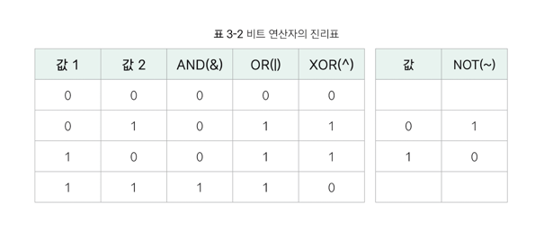
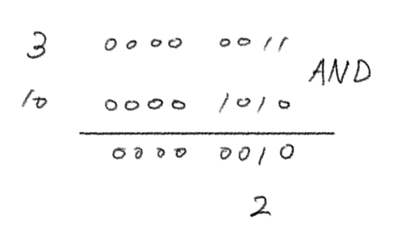
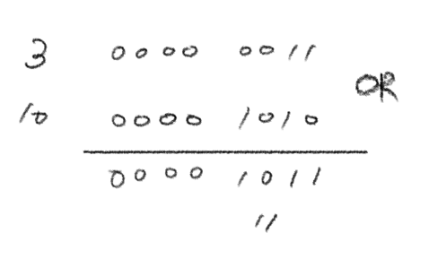
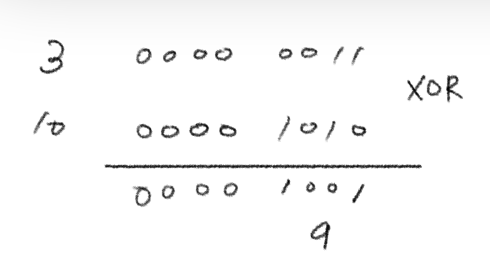
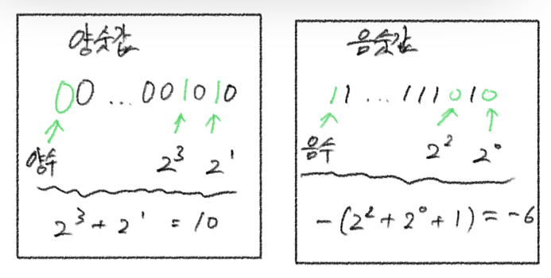
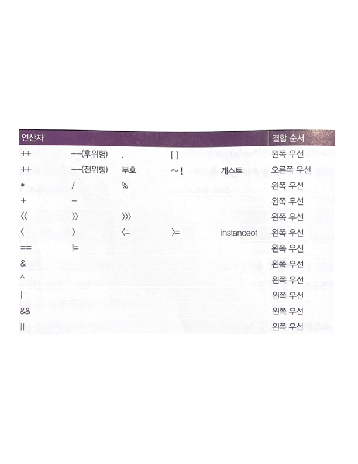

# 3주차 과제: 연산자

# 목표

자바가 제공하는 다양한 연산자를 학습하세요.

# 학습할 것

* 산술 연산자
* 비트 연산자
* 관계 연산자
* 논리 연산자
* instanceof
* assignment(=) operator
* 화살표(->) 연산자
* 3항 연산자
* 연산자 우선 순위
* (optional) Java 13. switch 연산자

# 산술 연산자

자바의 연산자는 C와 유사함. 갯수는 많아도 대부분 상식과 일치하며 자주 쓰는 것은 몇 개 없어서 난이도는 낮은 편.<br/>

> <h3>이항 연산자</h3>
> 피연산자가 양쪽에 두 개<br/>
> a<sup>피연산자</sup> + b<sup>피연산자</sup>

> <h3>단한 영산자</h3>
> 피연산자가 하나
> c<sup>피연산자</sup>++

사용빈도가 높은 연산자

* \+(더하기)
* \-(빼기)
* \*(곱하기)
* \\(나누기)
* \%(나머지)

디지털 세계의 나누기 연산자와 나머지 연산자는 수학과 약간 다름. 자바에서의 나눗셈은 피연산자 타입에 따라 결과가 달라짐.

정수끼리 나누면 정수가 되고, 실수끼리 나누면 실수가 됨.

```java
public class JavaTest {
    public static void main(String[] args) {
        int a = 6, b = 4;
        System.out.println("%d + %d = %d".formatted(a, b, a + b)); // 6 + 4 = 10
        System.out.println("%d - %d = %d".formatted(a, b, a - b)); // 6 - 4 = 2
        System.out.println("%d * %d = %d".formatted(a, b, a * b)); // 6 * 4 = 24
        System.out.println("%d / %d = %d".formatted(a, b, a / b)); // 6 / 4 = 1
        System.out.println("%d / %d = %f".formatted(a, b, ((float) a / b))); // 6 / 4 = 1.50000
    }
}
```

위 코드에서 a와 b를 각각 6과 4로 초기화하고 산술 연산자로 두 값을 계산했다.<br/>
유의해야 할 점은 6을 4로 나누면 수학적 정답은 1.5이나, a와 b가 둘 다 정수형이므로 몫 1만 취하고 나머지는 버린다.

소수점 이하까지 정밀하게 계산하고 싶은 경우에는 피연산자를 실수로 선언하여 실수 나눗셈을 해야 한다. 또는 피연산자 중 하나를 잠시 실수형으로 캐스팅한다. `((float) a / b))`

나머지 연산자 `%`는 두 수를 나눈 후 몫은 버리고 나머지만 취한다. 14를 5로 나누면 몫 2와 나머지 4가 발생하는데 몫은 관심이 없고 나머지인 4만 구한다.

<b>나머지는 몫이 정수일 때만 발생하며 실수 연산에는 발생하지 않는다. 14.0을 15.09으로 나누면 몫만 2.8로 계산할 뿐...</b>

> <h3>6 = 4 * 1<sup>몫은 얼마든간에 버린다.</sup> + 2<sub>나머지만 취한다.</sub></h3>

**피연산자가 실수일 때는 몫을 정수까지만 계산하고 나머지를 리턴**한다. 예를 들어 실수 5.0을 2.3으로 나누면 정수의 몫 2를 버리고 나머지 0.4를 리턴한다.

[참조](https://www.aladin.co.kr/shop/wproduct.aspx?ItemId=293210269)

---

# 비트 연산자

> 말 그대로 비트 단위의 연산자로, AND(&), OR(|), XOR(^), NOT(~)이 있다.

#### AND(&)

두 값이 모두 1일 때만 1인 연산자

#### OR(|)

두 값이 모두 0일 때만 0인 연산자

#### XOR(^)

두 값이 같을 때 0, 다를 때 1인 연산자

#### NOT(~)

0은 1, 1은 0으로 반전하는 연산자



## 비트 연산 과정

비트 단위의 연산을 직접 계산하기 위해서는 10진수를 비트 단위의 표현 방식인 2진수로 바꿔 표기할 수 있어야 함.

### AND 연산

10진수 3은 2진수로 변환하면 00000011이고, 10진수 10은 2진수 00001010로 변환된다.<br/>
이 두 정수의 각 비트 간 AND 연산 결과는 2진수 00000010이며, 이를 10진수로 변환하면 2가 된다.



### 비트 연산을 할 때 사용되는 비트 수

---
실제 비트 연산을 수행할 때의 최소 단위는 int(4byte = 32bit)이므로 10진수 3을 2진수로 변환하면 0이 30개, 1이 2개인 32비트 2진수로 변환됨.<br/>
다만 앞의 0들은 연산 결과에 영향을 미치지 않으므로 생략해 표현할 수 있음.
즉, 다음 코드에서 변수 a, b, c는 모두 같은 수를 저장하고 있음.

```java
public class Test {
    public static void main(String[] args) {
        int a = 3;
        int b = 0b00000000000000000000000000000011;
        int c = 0b0011;
    }
}
```

### OR 연산



### XOR 연산



## 비트 NOT 연산 과정

비트 NOT 연산자를 이해하기 위해서는 우선 양숫값과 음숫값을 읽는 방법을 알아야 한다.<br/>
**값의 첫 번째 비트는 부호 비트(0: 양수, 1: 음수)로, 숫자의 부호를 결정**한다.

부호가 결정되면 나머지 비트로 값을 읽으면 되는데, 양수는 1을 기준으로 값을 읽는다. 반면, 음수는 0을 기준으로 값을 읽은 후 1을 더한 값이 음수의 절댓값이다.

예를 들어 2진수 00...01010은 양수이므로 1을 기준으로 읽으며, 읽은 값은 +10(=2<sup>3</sup>+2<sup>1</sup>)을 의미함.<br/>
반면 11...11010은 음수이므로 0을 기준으로 읽은 값에 1을 더한 값인 6(=2<sup>2</sup>+2<sup>0</sup>+1)에음의 부호만 붙인 값(-6)을 의미한다.



비트 NOT 연산자는 0과 1을 반전시키는 연산으로, 부호 비트까지 반전시키므로 비트 NOT 연산자를 수행하면 항상 부호가 바뀌게 된다.

```java
public class Test {
    public static void main(String[] args) {
        System.out.println(~3);             // -4
        System.out.println(~0b00000011);    // -4
        System.out.println(~0x03);          // -4

        System.out.println(~0);             // -1
        System.out.println(~0b00000000);    // -1
        System.out.println(~0x00);          // 01

    }
}
```

## 시프트 연산자

> 비트의 위치를 좌우로 이동하는 연산으로, 산술 시프트(<<, >>)와 논리 시프트(>>>)가 있다.

### 산술 시프트

**숫자의 부호 비트는 유지**하면서 나머지 비트를 왼쪽 또는 오른쪽으로 이동하는 연산자.<br/>

<<연산을 수행할 때마다 부호 비트를 제외한 전체 비트가 왼쪽으로 이동하므로 1bit 이동 할 때마다 X2 효과가 있다.<br/>
반면 >>연산을 수행하면 부호 비트를 제외한 나머지 전체 비트가 오른쪽으로 이동하므로 1bit 이동할 때마다 %2의 효과가 있다.

#### 주의해야할 점

이동한 이후에 발생하는 빈칸에 주의해야 한다. 빈칸을 채우는 방식은 시프트 방향에 따라 다르다.<br/>
<< 연산일 때 빈칸이 오른쪽애 생기며 0으로 빈칸을 채운다.<br/>
반면 >> 연산일 때 빈칸은 왼쪽 부호 비트 다음에 생기며, 이때는 **부호 비트값과 동일한 값으로 채운다.**

### 논리 시프트

**부호 비트를 포함해 전체 비트를 오른쪽으로 이동**시키는 연산으로, 빈칸은 모두 0으로 채운다.

부호 비트까지 이동시키므로 부호 비트가 1인 음수일 때 논리 시프트 이후에는 값이 양수로 변할 것이다.

---

# 관계 연산자

비교 연산자라고도 한다. 이러한 비교 연산자를 보기 전에 먼저 상등 연산자를 보자면, 상등(Equality) 연산자는 좌우변의 값이 같은지, 다른지 비교하며 그 결과를 boolean 타입으로 리턴함.

| 연산자 |      설명      |
|:---:|:------------:|
| ==  | 좌변과 우변이 같다.  |
| !=  | 좌변과 우변이 다르다. |

'다르다'라는 표현은 수학에서 ≠ 기호를 쓰지만, 키보드에 없는 문자기 때문에 프로그램에서는 !=를 사용한다.<br/>
대입 연산자 = 은 기호가 하나인데 비해 상등 연산자는 ==로 기호를 두 번 쓴다.

그러니까 수학의 = 기호에 해당하는 자바의 연산자는 == 이다.
> a = 3; //a 에 3을 대입한다.<br/>
> if (a == 3) // a가 3인지 조사한다.

비교(Relational) 연산자는 좌우변 값의 크기를 비교해서 그 결과를 진위형(boolean)으로 리턴한다.<br/>
수학 기호와 유사한 부등호 모양이어서 외우기 쉽고 직관적인 편.

| 연산자 |      설명       |
|:---:|:-------------:|
| \<  |   좌변이 더 작다.   |
| \>  |   좌변이 더 크다.   |
| \<= | 좌변이 더 작거나 같다. |
| \>= | 좌변이 더 크거나 같다. |

상등과 비교 연산자는 두 값을 비교한다는 면에서 기능상 유사하지만, 몇 가지 차이가 있다.<br/>
상등 연산자는 비교 연산자에 비해 우선순위가 낮고 참조형끼리도 비교할 수 있다는 점이 다르다.

> if(obja == objb)

**상등 연산자로 참조형을 비교하면 같은 주소를 가리키는지 비교<sup>즉, 스택 메모리의 값을 비교</sup>**하여 문자열이나 배열이 같은 객체인지 조사한다.

반대로 대소를 따지는 비교 연산자는 크고 작은 순서가 있는 수치값에만 사용할 수 있다.<br/>
그래서 객체는 크다, 작다의 순서를 정할 수 없어서 부등 비교는 할 수 없다.

---

# 논리 연산자

> 두 가지 이상의 조건을 평가하여 조합하는 연산자<br/>
> **피연산자는 모두 boolean 타입이며 리턴 타입도 boolean 타입이다.**


조건 조합 방식에 따라 세 가지 연산자가 존재한다.

| 연산자 |     이름     |         설명          |
|:---:|:----------:|:-------------------:|
| &&  |  and(논리곱)  | 양변이 모두 참일 때만 참을 리턴  |
| ll  |  or(논리합)   | 양변 중 하나라도 참이면 참을 리턴 |
|  !  | not(논리 부정) | 논리값의 평가 결과를 반대로 뒤집음 |

예를 들어서 변수가 일정한 범위에 속하는지 조사하려면 두 가지 조건을 && 연산자로 묶어 동시에 만족하는지 점검해야 한다.
value의 값ㄷ이 5 ~ 10 사이에 있는지 알고 싶다면 다음 두 조건을 모두 만족해야 한다.
> value > 5<br/>
> value < 10

수학에서는 5 < value < 10 이라는 표현으로 5와 10 사이의 범위를 표현하지만, <br/>
자바의 조건문은 피연산자가 두 개로 정해져 있어 이런 복합적인 표현을 할 수 없다.
-> **두 조건을 개별적인 비교문으로 각각 평가 후 논리 연산자로 결합**

## 쇼트 서킷

이러한 논리 연산은 비트 연산으로도 수행 가능하다. 일반적으로 비트 연산자의 양쪽에 위치하고 있는 피연산자는 정숫값이지만,
양쪽 피연산자의 자리에 불리언값이 위치하면 비트 연산자는 비트 연산이 아닌 논리 연산을 수행한다.

논리 연산자로 논리 연산을 수행하는 것과 비트 연산자로 논리 연산을 수행하는 것의 차이점은...?<br/>
그것은 바로 **쇼트 서킷**<sup>short circuit</sup>의 적용 여부다.

쇼트 서킷이란 연산을 수행하는 과정에서 결과가 이미 확정된 경우 나머지 연산 과정을 생략하는 것을 의미한다.
예를 들어 (5 > 3) || (3 < 2) 를 수행한다면 왼쪽의 (5 > 3)이 true 이므로
오른쪽 항의 결과와는 상관없이 최종 결과는 항상 true일 것이다.<br/>
이럴 경우에는 오른쪽 항인 (3 < 2)를 아예 읽지도 않는 것이 쇼트 서킷이다.

논리 연산자로 논리 연산을 수행할 때는 쇼트 서킷이 적용되지만, 비트 연산자로 논리 연산을 수행하면 쇼트 서킷이 적용되지 않는다.
이 말은 즉슨, 비트 연산자일 때 계산 과정에서 결과가 이미 확정돼도 나머지 연산을 모두 수행한다는 소리다.

쇼트 서킷은 단순히 불필요한 계산 과정을 생략하는 것이므로 결과에는 아무런 영향을 미치지 않는다.

```java
public class Test {
    public static void main(String[] args) {
        // 논리 연산자
        System.out.println(true && false); // false
        System.out.println(true || (5 < 3)); // true
        System.out.println((5 >= 5) ^ (7 > 2)); // false

        // 비트 연산자
        System.out.println(true & false); // false
        System.out.println(true | (5 < 3)); // true
        System.out.println((5 >= 5) ^ (7 > 2)); // false
    }
}
```

두 연산자를 이용한 논리 연산의 결과가 항상 동일하면서 논리 연산은 불필요한 계산을 생략했기 때문에 논리 연산자가 더 좋아 보일 수 있다.
하지만 쇼트 서킷을 의도적으로 적용하면 안되는 경우도 있다.

```java
public class Test {
    public static void main(String[] args) {
        int a, b, c;
        // 논리 연산자
        a = 3;
        b = 3;
        c = 3;

        System.out.println(false && a++ > 6); // false
        System.out.println(true || b++ > 6); // true
        System.out.println(true ^ c++ > 6); // true
        System.out.println(a); // 3
        System.out.println(b); // 3
        System.out.println(c); // 4

        // 비트 연산자
        a = 3;
        b = 3;
        c = 3;

        System.out.println(false & a++ > 6); // false
        System.out.println(true | b++ > 6); // true
        System.out.println(true ^ c++ > 6); // true
        System.out.println(a); // 4
        System.out.println(b); // 4
        System.out.println(c); // 4
    }
}
```

논리 연산과 비트 연산의 각 오른쪽 피연산자에 증감 연산자가 포함돼 있다.
논리 연ㅅ나자일 때 왼쪽 항의 결과로 이미 결과가 결정됐을 때는 오른쪽 항을 실행시키지 않으므로 각 변수의 증감 연산은 이뤄지지 않는다.
반면 비트 연산자를 이용해서 동일한 논리 연산을 수행하면 연산 결과의 결정 시기와 관계없이 항상 각 변수의 증감 연산이 수행된다.

논리 XOR로 연산 결과를 계산하기 위해서는 항상 양쪽 값을 모두 확인해야 하므로 쇼트 서킷을 구조적으로 적용할 수 없다.
이것이 바로 논리 XOR 연산과 비트 XOR 연산 기호(^)가 동일한 이유다.

---

# instanceof

> 좌변의 객체가 우변의 타입이 맞는지 조사하여 진위형을 리턴한다.

객체의 정적인 선언 타입을 보는 것이 아니라 실제 가리키고 있는 타입을 점검하여 객체가 우변 타입이면 true를 리턴.

```java
class Animal {
    void move() {
        System.out.println("왔다리 갔다리");
    }
}

class Dog extends Animal {
    void bark() {
        System.out.println("멍멍멍");
    }
}

class Dove extends Animal {
    void fly() {
        System.out.println("퍼득 퍼득");
    }
}

class JavaTest {
    public static void main(String[] args) {
        Dog happy = new Dog();
        testAnimal(happy);
    }

    static void testAnimal(Animal animal) {
        animal.move();
        if (animal instanceof Dog) {
            Dog mydog = (Dog) animal;
            mydog.bark();
        }

        if (animal instanceof Dove) {
            Dove mydove = (Dove) animal;
            mydove.fly();
        }
    }
}
```

## instanceof 패턴 매칭

상속 관계에 있는 객체 집합을 다룰 때 instanceof 연산자와 캐스트 연산자는 굉장히 실용적이다.<br/>
다만, 1. 타입 확인 후 2. 지역변수 선언하고 3. 캐스팅을 따로 해야 한다는 점에서 번거롭다.

JDK 16부터는 타입 확인과 변수 선언, 캐스팅까지 한 번에 수행할 수 있는 패턴 매칭 구문이 도입되었다.

> if (변수 instanceof 타입 캐스팅변수)

이를 활용하면 앞 예제를 다음과 같이 더 짧게 사용하는 것도 가능하다.

```java
class JavaTest {
    public static void main(String[] args) {
        Dog happy = new Dog();
        testAnimal(happy);

        Dove donald = new Dove();
        testAnimal(donald);
    }

    static void testAnimal(Animal animal) {
        animal.move();
        if (animal instanceof Dog mydog) {
            mydog.bark();
        }
        if (animal instanceof Dove mydove) {
            mydove.fly();
        }
    }
}
```

# assignment(=) operator

> 우변의 변숫값이나 수식의 연산 결과를 좌변의 변수에 대입한다.

> a = 3;<br/>
> b = c * d;<br/>
> k = (2 + 3) + 4;

대입 연산자는 변수의 값을 변경하므로 좌변의 피연산자는 값을 대입 받을 수 있어야 한다.
대입 연산자의 왼쪽에 올 수 있는 값을 좌변값(Left Value)라고 하는데 실제 메모리를 점유하고 있고 값을 기억할 수 있는 대상이다.

또한 대입 연산자는 다른 연산자와 결합해서 축약된 형태로 사용할 수 있다. 일반적인 표현<sup>a = a + 3</sup>으로는 변수 a가 좌우에 존재하는데,
축약 형태는 이 중 오른쪽의 a 하나를 없앤 형태다.
축약 표현은 단순이 수식만 간략화한 것으로 실행 결과에는 아무런 영향을 미치지 않는다.

---

# 화살표(->) 연산자

자바 8 이전에는 동작을 인수로 전달하기 위해 메소드를 객체로 감싸 전달하는 방법이 유일했다.
그러다 보니 불필요한 클래스를 선언한 후 메소드를 고현, 객체를 생성하는 다량의 코드가 필요했다.

```java
interface AgeFilter {
    boolean isAgeOk(int age);
}

class AgeOver implements AgeFilter {

    @Override
    public boolean isAgeOk(int age) {
        return (age > 30);
    }

}
```

위의 코드에서 정작 실행할 코드는 오로지 age > 30 비교 연산식밖에 없는데도 불구하고 나머지 클래스 선언문, 메소드 선언문은 코드를 감싸기 위한 껍데기일 뿐이다.
심지어 공통의 인수 타입을 만들기 위해 인터페이스를 선언하고 클래스 계층을 구상하며 new 연산자로 객체를 생성해야 한다.

자바 8부터는 이러한 불필요한 코드를 제거하는 단축 문법을 제공한다. 람다 표현식은 **함수를 압축하여 값으로 표현**한 것이다.
기본 형식은 `인수 -> 본체`이다.

```java
interface AgeFilter {
    boolean isAgeOk(int age);
}


class JavaTest {
    static int[] arAge = {29, 30, 34, 32, 30, 31, 28, 31, 29, 30};

    public static void main(String[] args) {
        System.out.println("over = " + count(a -> a > 30));
        System.out.println("under = " + count(a -> a < 30));
    }

    static int count(AgeFilter op) {
        int num = 0;
        for (int i = 0; i < arAge.length; i++) {
            if (op.isAgeOk(arAge[i])) num++;
        }
        return num;
    }
}
```

위 코드에서 main에서 두 개의 람다식을 사용했는데 위쪽에 있는 람다식만 분석해보녀 다음과 같다.

> <h2>a<sub>인수 a를 받아</sub> -> a > 30<sub>a가 30보다 더 큰지 조사한다.</sub></h2>

이 람다식은 메소드를 간략하게 표현한 것이며 AgeFilter 인터페이스의 isAgeOk 메소드와 같다.

AgeFilter는 정수를 받고 진위형을 리턴하는 메소드를 정의하는데 람다식의 시그니처로 사용할 뿐 그 외의 용도는 전혀 없다.
이러한 시그니처는 흔히 사용되어서 `java.util.function` 패키지에 `Predicate`라는 이름으로 이미 선언되어 있다.

## 람다식

### 람다식의 형식

> 코드를 간략한 형식으로 표기한 것.<br/>
> 람다식은 간결한 표현으로 편의성을 향상시킬 뿐 새로운 기능을 제공하는 것이 아니다.

람다는 함수를 압축하여 표기한다. 함수와 마찬가지로 인수를 받고 본체를 실행한 후 리턴값을 반환하며 발생 가능한 예외 목록도 밝힐 수 있다.<br/>
그러나 이름이 없고 지정자도 붙이지 않으며 본체 코드가 간결하다는 점이 다르다.

기본 형식은 다음과 같다.
> (인수 목록) -> { 본체 }

-> 기호를 기준으로 왼쪽에 인수 목록을 쓰고, 오른쪽에 본체를 쓰며 인수를 받아 본체의 코드를 실행한다. 또한, 가급적 짧게 쓰기 위해 여러 가지 변형도 허락한다.

> (int i) -> { System.out.println(i + 1) }<br/>
> 정수형 인수 i를 받아 1을 더한 값을 출력한다.<br/>
> 위의 람다식은 아래 메소드와 똑같은 기능을 한다.(실제로도 대체 가능하다.)<br/>
> void printOnePlus(int i) {<br/>
> System.out.println(i + 1);<br/>
> }

람다식은 리턴 타입을 따로 밝히지 않으며 문맥에 따라 자동으로 결정한다.

```java
class JavaTest {
    public static void main(String[] args) {
        (int i) -> {
            int sum = 0;
            for (int a = 1; a <= i; a++) {
                sum += a;
            }
            System.out.println(sum);
        }
    }
}
```

블록 안에 지역변수를 선언할 수 있고 루프를 돌릴 수도 있다. 얼마든지 긴 코드를 작성해서 넣을 수 있지만 람다식은 짧게 쓰는 것이 존재 이유여서 이렇게 길다면 일반 메서드로 만드는 것이 더 어울린다.

람다식도 값을 리턴할 수 있다. 이때는 메서드와 마찬가지로 return 명령을 사용한다.

> (int i) -> {return i + 1};

람다식은 조건이 맞은면 생략 가능한 요소가 많다. 명령문 하나로만 구성된 람다식은 {} 괄호를 생략하고 값을 리턴하는 명령문은 return 키워드도 생략한다.<br/>
{} 가 없으면 디폴트 명령이 return이라고 가정한다. 위의 람다식은 다음처럼 더 짧아질 수 있다.
> (int i) -> i + 1;

{}가 없어지고 명령문 대신 리턴할 표현식만 기록한다. 컴파일러는 람다식의 타입을 통해 인수의 타입을 추론한다. 위 람다식에서 타입 선언문을 생략할 수 있다.
> i -> i + 1

### 함수형 인터페이스

불행히도 자바에는 함수형이 없다. 완전한 객체지향 언어인 자바에서 함수는 클래스를 구성하는 멤버일 뿐 단독으로 사용할 수 없다.
그러나 이제는 함수를 값으로 취급할 수 있어 함수의 시그니처를 선언할 필요가 생겼다.

원래 없었던 함수셩을 표기하는 문법을 새로 만들어야 하는데 이는 너무나도 번거로운 일이며 언어가 복잡해진다.
그래서 자바는 람다의 시그니처를 정의하는 대체적인 방법을 사용하는데 이것이 바로 함수형 인터페이스다.

함수형 인터페이스(Functional Interface)는 딱 하나의 추상 메소드로 람다의 시그니처를 정의한다. 그러니까 함수를 포함하는 인터페이스를 정의하는 문법을 응요하는 셈이다.
시그니처를 정의하는 것이 목적이므로 메소드는 반드시 하나만 있어야 한다.

```java
class JavaTest {
    public static void main(String[] args) {
        PlusOne po = i -> i + 1;
        System.out.println("result = " + po.plus(5));
    }
}

interface PlusOne {
    int plus(int i);
}
```

위 예제에서 PlusOne이 함수형 인터페이스이며 plus 추상 메소드가 람다의 시그니처를 정의한다.
자바8 이전에는 PlusOne을 상속받은 또다른 클래스를 정의하고 PlusOne#plus 메소드를 구현한 후, 그 객체를 새로 만들기까지 해야 했다.
그러나 실제 사용자가 필요한 로직은 i를 받아 i + 1을 리턴하는 코드 뿐이다.

이러한 복잡한 구문을 짧게 줄여 표기하는 것이 람다식이며, 긴 구문이 i -> i + 1로 짧아진다.
데이터는 물론이고 이 데이터를 처리할 동작까지 람다식으로 정의하여 값으로 전달할 수 있으니 코드가 엄청 짧고 간결해진다.

### 외부 변수 액세스

람다식은 함수형 인터페이스를 구현하는 **임시 객체**로 생성된다. 이러한 객체는 익명 클래스가 되어 main 메서드의 내부에 있는 로컬 클래스이다.
로컬 클래슨느 소속 메소드의 지역변수를 액세스할 수 있다.

```java
class JavaTest {
    public static void main(String[] args) {
        int value = 123;
        class PlusOneImpl implements PlusOne {
            @Override
            public int plus(int i) {
                System.out.println(value);
                return i + 1;
            }
        }

        PlusOne po = new PlusOneImpl();
        System.out.println("result = " + po.plus(5));
    }
}
```

이를 람다로 바꾸어도 똑같이 main 메소드 내의 value 변수를 참조할 수 있다.
물론 값이 바뀌어서는 안된다. value가 final이 아니라 값이 변경되어 로컬 클래스로 전달할 수 없다.

내부 클래스에 비해 약간의 차이는 존재한다. 익명 구현 클래스의 메소드 내에서 this는 자기 자신을 의미하지만, 람다식에서의 this는 람다식을 실행한 객체를 의미한다.

---

# 3항 연산자

3항 연산자의 형태는 다음과 같다.

> 조건식 ? 참값 : 거짓값

if else는 문장이지만 3항 연산자는 표현식이어서 수식 내에서 사용할 수 있다.
연산 결과가 값이어서 수식이 들어가는 곳이면 어디든 대체 가능하다.

반대로 if else 문은 표현식이 아니라 인수열에 쓸 수 없다.

> println(if ... else ...)

정리하자면 if 문은 선택만 하는 것이 아니라 능동적인 동작을 지정할 수 있고 여러 개의 명령을 블록으로 묶을 수 있어 범용적이나, 값 하나만 선택하는 용도라면 3항 연산자가 더 간편하다.

> <h3>value % 2 == 0<sup>value가 짝수</sup> ? "짝"<sup>이면</sup> : "홀"<sup>아니면</sup></h3>

---

# 연산자 우선 순위

수학에서도 덧셈보다 곱셈을 먼저 처리하는 것 처럼 Java에서도 연산자 간의 우선 순위가 존재한다.



연산 순위가 헷갈리거나 모호하면 괄호를 사용하여 우선순위를 명시적으로 지정하는 것이 좋다.

```java
class JavaTest {
    public static void main(String[] args) {
        int a = 1;
        int b = 2;
        int c = 3;
        int d = 4;

        if (a == 1 || b == 2 && c == 10 || d == 10) {
            System.out.println("진실");
        } else {
            System.out.println("거짓");
        }
    }
}
```

양쪽에 || 식이 있고 가운데에 && 식이 있어 사람의 직관력은 다음과 같이 해석한다.

> (true || true) && (false || false)

그러나 || 보다는 && 의 순위가 더 높아 컴파일러는 다음 순서대로 평가한다.

> true || (true && false) || false

결국 제일 좌변이 true 이므로 전체식도 true다.

다음 연산식도 많이 헷갈리는 예다.
> int value = 2;<br/>
> value = value * 3 + 4;

간단한 수식이라 결과가 10임을 쉽게 알 수 있다. 그런데 다음과 같이 바꿨다고 가정해본다면
> value *= 3 + 4;

똑같은 수식이지만 복합 대입 연산자의 우선순위가 꼴찌여서 완전히 다른 결과가 도출된다.

1. 3과 4가 먼저 더해져 7이 되고,
2. 2(value)에 값을 곱해 결과는 14가 된다.

---

# Java 13, switch 연산자

(Java 14부터 아님...?)

Switch 제어문(Statement)은 변숫값에 따라 명령을 선택하는데 비해 Switch 표현식(Expression)은 값을 선택하는 용도로 주로 사용한다.
기본 형식은 다음과 같다.

```
switch(제어변수) {
    값1 -> 결괏값1;
    값2 -> 결괏값2;
    default -> 그 외의 결괏값;
}
```

Switch 표현식 자체가 하나의 값이 된다. 결괏값이 없을 수는 없기 때문에 default 구문을 생략할 수 없다.

Switch 제어문은 해당 case가 없으면 아무것도 안 하면 되지만, Switch 표현식은 뭐라도 값을 결정해야 한다.
단, 예외적으로 제어 변수가 열거형이고 열거 멤버에 대한 case가 다 있으면 default는 생략할 수 있다.

제어 변숫값에 따라 -> 오른쪽의 값을 바로 결정하기 때문에 break 문은 필요 없다.

```java
class JavaTest {
    public static void main(String[] args) {
        int ranking = 2;
        String medal = switch (ranking) {
            case 1 -> "금메달";
            case 2 -> "은메달";
            case 3 -> "동메달";
            default -> "참가상";
        };
        System.out.println(medal + "을 수여합니다.");
    }
}
```

명령을 수행한 후 값을 리턴할 때는 `yield` 명령을 사용한다. 예를 들어 다른 메달과 달리 금메달인 경우에 한해 특별한 축하 메시지를 출력하고 싶으면 다음과 같이 하면 된다.

```java
class JavaTest {
    public static void main(String[] args) {
        int ranking = 2;
        String medal = switch (ranking) {
            case 1 -> {
                System.out.println("축하합니당");
                yield "금메달";
            }
            case 2 -> "은메달";
            case 3 -> "동메달";
            default -> "참가상";
        };
        System.out.println(medal + "을 수여합니다.");
    }
}
```

---