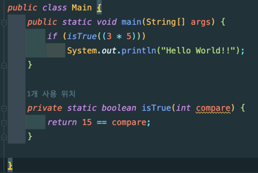
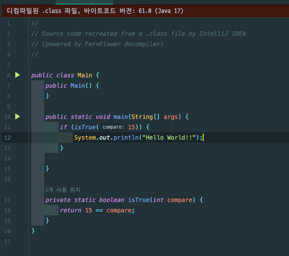
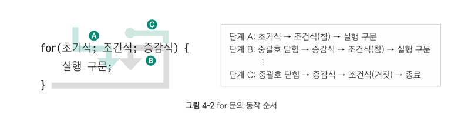
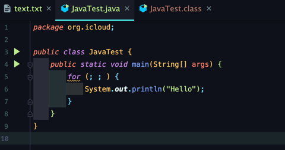
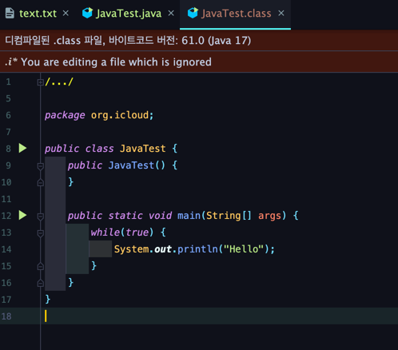
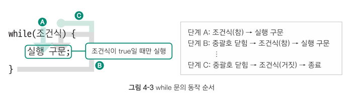

# 4주차 과제: 제어문

# 목표

자바가 제공하는 제어문을 학습하세요.

# 학습할 것 (필수)

* 선택문
* 반복문

## 들어가기 앞서...

제어문과 제어 키워드를 이용하면 프로그램의 실행 순서를 다양한 방법으로 제어할 수 있다. 즉, 제어문은
> 프로그램의 처리 순서를 반복하는 것

이라고 생각하면 되겠다.

자바에는 2개의 선택 제어문(if, switch)과 3개의 반복 제어문(for, while, do-while)으로 구성된 5개의 제어문과 2개의 제어 키워드(break, continue)가 있다.

5개 제어문의 공통적인 특징은 모두 중괄호`{}`가 있다는 것이다.<br/>
그러나 중괄호 안에 실행문이 1개일 때는 중괄호를 생략할 수 있다.
> 중괄호를 생략하면 컴파일러가 하나의 실행문만 감싸는 중괄호를 자동으로 삽입해 준다.
>
> <sup>중괄호로 감싸지 않은 코드</sup><br/>
> 
>
> <sup>중괄호로 싸지 않은 코드를 컴파일한 결과</sup>
> 

# 선택문

## if 선택 제어문

> if문은 조건식에 따라 실행문의 실행 여부를 결정하는 선택 제어문.

if문의 구조는 크게 3가지로 나뉜다.

1. if 단일 구문<br/>
   조건식 1개, 중괄호 1개가 있는 구조로, `조건식 = true` 일 때 중괄호 안을 실행, `조건식 = false`일 때 중괄호 안 실행 안함.

   ```java
   public class JavaTest {
       public static void main(String[] args) {
           if (조건식) { // boolean 타입(true, false)만 가능
               실행구문; // 조건식이 true인 경우에만 실행
           }
       }
   }
   ```
2. if-else 구문<br/>
   조건식 하나와 중괄호 2개가 있는 형태.<br/>
   if 구문의 조건식이 true 일 때 if 구문의 조건식이 실행되고, false 일 때 else 구문의 중괄호 실행.

   모든 조건식은 true가 아니면 false이므로 둘 중 하나는 반드시 실행되며, 줄 중 하나만 실행된다.
   이런 조건식의 결괏값에 따라 둘 중 하나를 선택하는 제어문이므로 삼항 연산자와 상호 변환이 가능하다.

   ```java
   public class JavaTest {
       public static void main(String[] args) {
           if (5 > 3) {
               System.out.println("살행1"); // 실행됨.
           } else {
               System.out.println("실행 2"); // 실행 안 됨.
           }
   
           int a, b;
           a = 5;
           b = 0;
           if (a > 5) {
               b = 10; // 실행 안 됨.
           } else {
               b = 20; // 실행됨.
           }
           System.out.println(b);
   
           // 삼항 연산자로 변환.
           a = 5;
           b = 0;
           b = (a > 5) ? 10 : 20;
           System.out.println(b); // 20    
       }
   }
   ```

3. if-else if-else 구문
   N개의 조건식과 N + 1개의 중괄호를 포함하고 있는 형태로, if-else if-else의 구조이다.<br/>
   중간의 else if 구문 역시 생략 가능.
   ```java
   public class JavaTest {
       public static void main(String[] args) {
           if (조건식 1){
               실행 구문;
           }
           else if (조건식 2){
               실행 구문;
           }
           ...
          else if (조건식 N){
               실행 구문;
           }
          else{
               실행 구문;
           }
       }
   }
   ```
   else if 구문은 갯수에 상관없이 추가 가능하며, if 구문처럼 소괄호 안에 조건식이 들어가는 형태.<br/>
   기억해야 할 점은, 조건식을 검사할 때 항상 위에서부터 검사를 수행하며,
   처음으로 조건식이 true가 나오는 중괄호 블록을 만나면 해당 블록의 중괄호를 실행하고 if문을 탈출한다.<br/>
   **즉, 중괄호가 100개 있다 하더라도 처음 참이 되는 블록 하나만 실행!!**<br/>
   물론 모든 조건이 false라면 마지막 else 구문이 실행된다.<br/><br/>

   위의 내용을 정리하자면 조건식 순서에 따라서는 전혀 다른 결과가 나올수도 있다는 것이다.

## switch 선택 제어문

> switch 문은 점프 위치 변숫값에 따라 특정 위치(case)로 이동해 구문을 실행하는 선택 제어문.

점프할 수 있는 위치는 `case 위칫값:`으로 설정한다.

이렇게 콜론(:) 문자가 붙은 값은 이동할 위치를 가리키는 일종의 팻말 역할을 한다고 생각하면 된다.<br/>
case 구문말고 default: 구문도 포함될 수 있는데 이는 if 문의 else 구문과 비슷한 기능으로,
일치하는 위칫값이 없을 때 점프할 위치를 나타낸다. default 구문은 경우에 따라 생략할 수 있다.

```java
public class JavaTest {
    public static void main(String[] args) {
        switch ("점프 위치 변수") { // -> 정수, 문자, 문자열 사용 가능
            case "위칫값 1": // -> 점프 위치 변수 = 위칫값 1이면 이 위치로 이동
                실행 구문;
            case "위칫값 2": // -> 점프 위치 변수 = 위칫값 2이면 이 위치로 이동
                실행 구문;
               ...
            case "위칫값 n": // -> 점프 위치 변수 = 위칫값 n이면 이 위치로 이동
                실행 구문;
            default:
                실행 구문;
        }
    }
}
```

switch 문의 역할은 특정 위치로 이동시키는 것이 전부다. 그러다 보니 if 문과는 조금 다르게 동작한다.

```java
public class JavaTest {
    public static void main(String[] args) {
        int a = 2;
        switch (a) {
            case 1:
                System.out.println("A");
            case 2: // -> switch(a)에 따라 case 2:로 이동한 후 차례대로 구문 실행
                System.out.println("B"); // 실행됨.
            case 3:
                System.out.println("C"); // 실행됨.
            default:
                System.out.println("D"); // 실행됨.
        }
    }
}
```

a의 값이 2이므로 switch 문의 역할은 `case 2:`로 실행 순서를 이동시키는 것이 전부다.
그 다음부터는 원래 프로그램 실행 순서대로 1줄씩 실행된다.<br/>
따라서 B, C, D가 모두 출력된다.

**switch 문도 if 문처럼 단 하나의 실행문만 실행하게 하고 싶을 경우에는 break 제어 키워드를 사용하면 된다.**

그러나 모든 case 별로 break를 지정할 경우에는 중복 코드가 많아 비효율적일 수도 있다.
이런 경우에는 다음과 같이 간결하게 코드를 작성할 수 있다.

```java
public class JavaTest {
    public static void main(String[] args) {
        int a = 8;
        switch (a) {
            case 10:
            case 9:
            case 8:
            case 7:
                System.out.println("Pass");
                break;
            default:
                System.out.println("Fail");
        }
    }
}
```

switch 문과 if 문 사이에 성능 차이가 있을까?
답은 전체적인 속도의 차이는 거의 없다고 보면 된다.

---

# 반복문

## for 반복 제어문

> 실행 구문을 반복적으로 수행하는 반복 제어문으로, 일반적으로 반복 횟수가 정해질 때 주로 사용.

기본 문법 구조는 다음과 같다.

```java
public class JavaTest {
    public static void main(String[] args) {
        for (초기식; 조건식; 증감식) {
            실행 구문; // -> 조건식이 true 인 동안 실행
        }
    }
}
```

for 다음의 소괄호`()` 안에는 3개의 항목이 존재하며, 각각은 세미콜론`;`으로 구분돼 있다.
컴파일러는 문법적으로 for 문의 소괄호 안에 세미콜론이 2개 있는지 여부만 점검한다.

* 초기식: for 문이 시작될 때 딱 한번 실행되고 다시는 실행되지 않는다.
  따라서 for 문 안에서만 사용할 변수는 주로 초기식에서 초기화한다.

* 조건식: 실행 구문으로 들어가기 위한 유일한 출입구로, 이 조건식의 결과가 true가 나오는 동안은 실행 구문을 계속 반복한다.
  만일 조건식이 false가 나오면 더 이상 반복을 수행하지 않고 for 문을 빠져나간다.
  **즉, for 문이 끝나는 위치는 닫힌 중괄호가 아닌 조건식이다.**

* 증감식: for 문의 실행 구문이 모두 수행된 후 닫힌 중괄호를 만나면 다음 번 반복을 위해 다시 이동하는 위치로
  매회 반복이 수행될 때마다 호출된다.

증감식 실행 이후에는 다시 조건식을 검사하며, 이후에는 앞의 과정이 반복된다.


앞서 언급한 것처럼 컴파일러는 for 문의 소괄호 `()` 안에 2개의 세미콜론 `;`이 있는지만 문법적으로 점검한다.
즉, 초기식, 조건식, 증감식을 생략하더라도 세미콜론만 있으면 문법 오류는 발생하지 않는다.

그 결과, 몇가지 특수한 for 문 형태가 가능하다.

> for의 실행 구문으로 진입하는 유일한 입구인 조건식을 생략하면 **컴파일러는 조건식에 `true`를 자동으로 삽입한다.**
> -> for 문으로 들어가는 문을 항상 열어놓은 셈. -> 따라서 for 문에서 조건식을 생략하면 무한 루프가 된다.
> <br/><br/>
> <sup>for 안의 식들을 생략한 경우<sup>(다음과 같이 컴파일 에러가 발생하지 않는다.)</sup></sup><br/>
> <br/>
> <sup>위의 소스코드를 컴파일 한 결과 <sup>for 문이 while문으로 바뀐 것을 확인할 수 있다.(JVM에서 자체적으로 최적화 작업에 들어간 것으로
> 보인다.[레퍼런스](https://stackoverflow.com/questions/9416583/for-loop-getting-conv래erted-to-do-while-loop-in-compiled-class-file))</sup></sup><br/>
> 

## while 반복 제어문

> 중괄호 안에 실행 구문을 반복적으로 실행한느 반복 제어문으로 소괄호 안의 조건이 true 인동안 반복이 지속된다.

while 반복 제어문의 기본 문법 구조는 다음과 같다.

```java
public class JavaTest {
    public static void main(String[] args) {
        초기식; // -> 필수는 아니지만 대부분 사용
        while (조건식) { // -> while 문 안으로 들어가는 유일한 입구, 생략 불가
            실행 구문; // -> 조건식이 true 인 동안 실행
            증감식; // -> 필수는 아니지만 대부분 사용
        }
    }
}
```

while문에서는 초기식은 while 문 실행 이전에 정의돼야 하고, 증감식은 중괄호 안에 있어야 for문과 동일한 수행을 하게 된다는 것이다.

실행 순서는

1. 먼저 조건식을 검사하고
2. 조건식이 `true`일 때 중괄호 안의 실행 구문을 실행한다.
3. 이후 닫힌 중괄호를 만나면 다시 조건식을 검사하며,
4. 이러한 과정이 조건식이 거짓이 될 때 까지 반복된다.

for 문과 마찬가지로 while 문이 종료되는 시점은 닫힌 중괄호가 아닌 조건식이다.



일반적으로 while 문은 반복 횟수를 정하지 않고 특정 조건까지 반복하고자 할 때 주로 사용.
예를 들어 자연수를 순서대로 더해 합계가 100보다 커지는 때의 숫자와 합계를 알고 싶을 때 while 문을 사용할 수 있겠다.

```java
public class JavaTest {
    public static void main(String[] args) {
        int num = 0;
        sum = 0;
        while (sum < 100) {
            sum += num;
            num++;
        }
        System.out.println((num - 1) + " 까지의 합 = " + sum);
    }
}
```

## do-while 반복 제어문

> while 문과 매우 비슷한 반복 제어문으로, 조건식의 검사와 반복 실행의 순서에만 차이가 있다.

do-while 문의 기본 문법 구조

```java
public class JavaTest {
    public static void main(String[] args) {
        초기식; // -> 필수 문법은 아니지만 일반적으로 사용
        do {
            실행 구문; // -> 최초 1회는 무조건 실행
            증감식; // -> 필수 문법은 아니지만 일반적으로 사용
        } while (조건식); // -> 문법 구조상 중괄호가 없으므로 세미콜론(;)으로 끝남.
    }
}
```

다른 제어문들과 달리 조금 특이하게 생겼는데 `do {...} while(조건식);` 형태로 마지막이 중괄호로 끝나지 않으므로 세미콜론`;`을 붙여야 한다.

실행 과정은

1. 일단 do 구문을 실행하고
2. 이후에 조건식을 검사한다.
3. 조건식이 참이면 다시 do 구문을 실행하고,
4. 거짓이면 제어문을 탈출한다.


while 문은 조건식을 먼저 검사하므로 최소 반복 횟수는 0이지만, do-while 문은 일단 실행한 후 조건식을 검사하므로 최소 반복 횟수가 1이다.
이외에는 while 문과 동일하다.