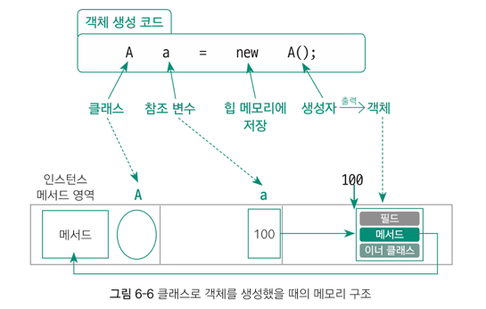
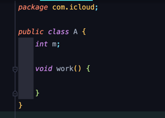
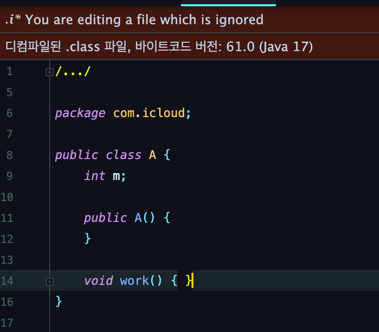

# 5주차 과제: 클래스

# 목표

자바의 Class에 대해 학습하세요.

# 학습할 것 (필수)

* 클래스 정의하는 방법
* 객체 만드는 방법 (new 키워드 이해하기)
* 메소드 정의하는 방법
* 생성자 정의하는 방법
* this 키워드 이해하기

# 클래스 정의하는 방법

> 클래스는 `class` 키워드와 함께 클래스명을 표기한다.<br/>
> 클래스명은 대문자로 시작하는 것이 관례다.

```java
class 클래스명 {
    ...
}
```

```java
package ...; // 패키지
import ...; // 임포트

class 클래스명 {...} // 외부 클래스
//////// 클래스 밖에 올 수 있는 3가지

public class A { // -> 파일명과 동일해야 함.
    int a = 3; // 필드

    double abc() {...} // 메소드

    A() {...} // 생성자

    class 클래스명 {...} // 이너 클래스
}
//////// 클래스 안에 올 수 있는 4가지
```

## 클래스 외부 구성 요소

1. 패키지<sup>package</sup>: 프로젝트를 생성할 때 패키지를 지정했다면 이 구성 요소에 패키지명이 포함되며, 반드시 주석을 제외하고 첫 번째 줄에 위치해야 한다.
   클래스 생성 과정에서 패키지를 생성하지 않았다면, 즉 디폴트 패키지를 사용하면 생략된다.


3. 임포트<sup>import</sup>: 다른 패키지의 클래스를 사용하고자 할 때 포함된다.


4. 외부 클래스<sup>external class</sup>: 클래스의 외부에 또 다른 클래스가 또 포함될 수 있다.
   즉, 1개의 .java 파일에 여러 개의 클래스가 포함될 수 있다는 것이다. 단, 외부 클래스에는 `public` 키워드를 붙일 수 없다.

## 클래스 내부 구성 요소

1. 필드<sup>field</sup>: 클래스의 특징을 나타내는 변수다.


2. 메소드<sup>method</sup>: 클래스가 지니고 이는 기능을 나타낸다.


3. 생성자<sup>constructor</sup>: 생성자`A() {...}`는 클래스의 객체를 생성하는 역할을 담당한다.


4. 이너 클래스<sup>inner class</sup>: 클래스의 내부에도 클래스가 포함될 수 있다. 이 클래스를 특별히 `이너 클래스`라고 한다.

# 객체 만드는 방법 (new 키워드 이해하기)

> 객체는 `new` 키워드로 생성할 수 있다. 자바에서는 대부분의 클래스가 이 방법으로 객체를 생성한다.

`클래스명 참조 변수명 = new 생성자()`

위의 객체 생성 코드를 구성하는 요소를 앞에서부터 살펴보자면

첫 번째는 **클래스명**, 두 번째는 **참조 변수**다.<br/>
참조 변수는 실제 데이터를 저장하는 것이 아니라 실제 데이터가 있는 힙 메모리의 위칫값을 가리키는 변수.

세 번째는 `new` 키워드로 `~을 힙 메모리에 넣어라.` 라는 의미이다.

마지막은 클래스와 이름이 동일하지만, 뒤에 소괄호가 붙어 있는 것이 다르다. 이 생성자가 실행되면 클래스의 객체가 생성된다.
> **따라서 `new`는 생성자의 결과물로 나온 객체를 힙 메모리에 넣는다.**

```java
public class A {
    public static void main(String[] args) {
        A a = new A();
    }
}
```

위의 예제 코드를 말로 풀어서 쓰면
> A() 생성자로 만든 객체를 힙 메모리에 넣고, 위칫값을 A 타입의 참조 변수 a에 저장하라
> 고 표현할 수 있다.

### 객체 생성에 따른 메모리 구조



클래스 A는 메모리의 클래스 영역, 참조 변수는 스택 영역에 들어간다. 내부 공간에는 실제 객체의 주소값을 저장한다.

생성자로 만들어진 객체는 힙 메모리에 위치하며, 객체 내부에는 클래스의 멤버들이 위치한다.<br/>
그런데 메소드를 살펴보면, **실제 메소드 구현 코드는 클래스 영역 안에 저장**해 놓고,
**객체 안에서는 메소드 영역의 위치만 가리키고 있다**는 것을 알 수 있다.

그 이유는 1개의 클래스로 만든 모든 객체는 속성은 달라도 기능은 동일하기 때문이다.<br/>
즉, 객체를 100개 만들어도 메소드는 한 번만 만들면 된다는 뜻이다.

---

# 메소드 정의하는 방법

> 메소드는 **클래스의 기능**에 해당하는 요소

```
자바 제어자 리턴(반환) 타입 메소드명(입력매개변수) {
   메소드 내용
}
```

**리턴타입**은 메소드 종료 이후 변환(또는 반환)되는 값의 자료형을 의미한다.

**메소드명**은 변수명 선정 규칙과 동일하며, **관례적으로 소문자로 시작한다.**

소괄호 안에는 **입력매개변수**가 들어오는데,
이는 메소드를 호출할 때 전달되는 값의 자료형과 전달받은 값을 저장할 지역 변수명을 정의한다.

중괄호 안에는 **메소드의 내용**이 들어가는데, 여기에 메소드가 수행해야 할 기능을 작성한다.


> ### 리턴 타입이 void 일 때 return 키워드의 의미
> void 리턴 타입은 리턴하지 않는다는 것을 의미하지만, 내부에 return 키워드를 사용할 수는 있다.
> 이 때 return은 `메소드를 종료하라.`는 의미다.
> ```java
> public class JavaTest{
>   public void printMonth(int m){
>       if(m < 0 || m > 12) {
>           System.out.println("잘못된 입력!~");
>           return;  
>       }
>       System.out.println(m + "월 입니다.");
>   }
> }
> ```

# 생성자 정의하는 방법

> 생성자는 객체를 생성하는 역할을 지닌 클래스의 내부 구성 요소

생성자를 작성할 때 지켜야 하는 문법적 규칙

* 반드시 클래스명과 동일한 이름으로 지어야 한다.
* 메서드와 비슷한 구조를 지니고 있지만, 리턴 타입이 없다.
    * `리턴 타입이 없다`와 `리턴하지 않는다(void)`는 전혀 다른 이야기. 생성자는 리턴 타입 자체가 없다는 말이다.

```
클래스명(매개입력변수){
}
```

> 또한 컴파일러는 생성자가 없는 클래스를 만들면 적어도 1개의 생성자가 필요하므로
> 매개변수가 없는 기본 생성자를 추가해준다.<br/>
> <sup>생성자가 없는 클래스 생성</sup><br/>
> <br/>
> <sup>위 코드의 컴파일 결과</sup><br/>
> 


생성자의 모양에 따라 객체를 생성하는 방법이 결정된다.
말 그대로, 어떤 클래스 안에 기본 생성자만 있다면 기본 생성자 모양으로만 객체를 생성,

int 형을 입력매개변수로 포함하고 있는 생성자만 있다면 int형 값을 입력으로 받아 생성자를 호출해야만 객체 생성이 가능하다.

이 말은 즉슨, 생성자도 메소드처럼 오버로딩이 가능하다는 소리이다.

---

# this 키워드 이해하기

> 모든 메소드에는 자신이 포함된 클래스의 객체를 가리키는 `this`라는 참조 변수가 있다.

### 내부 객체 참조 변수명인 this 키워드

모든 멤버는 객체 속에 존재하는 것이므로

```java 
int m = 3
```

이라는 필드를 클래스 내부에서 출력할 때도

```java
System.out.println(this.m);
```

과 같이 작성해야 한다.
다만 **this.를 생략하면 컴파일러가 자동으로 this. 을 추가**해 주기 때문에
지금까지 클래스 내부에서 필드와 메소드를 그대로 사용할 수 있던 것이다.

그러나 지역 변수는 멤버가 아니므로 this.가 자동으로 붙지 않는다.

this. 을 생략해도 항상 컴파일러가 추가해 주므로 굳이 신경 쓸 필요가 없어 보이지만, this.를 명시적으로 붙여야 할 때가 있다.

```java
public class A {
    int m;
    int n;

    void init(int m, in n) {
        // 필드와 지역 변수를 모두 사용할 수 있고 이름이 같을 때 지역 변수로 인식
        m = m;
        n = n;
    }
}
```

위에서 필드 m, n은 클래스 내부에 선언돼 있으며, 클래스 전체에서 사용할 수 있다.<br/>
반면 init() 메소드에서 선언된 지역 변수 m, n은 init() 메소드 내부에서만 사용할 수 있다.

따라서 init() 메소드 내부에서는 필드 m, n과 지역 변수 m, n을 모두 사용할 수 있게 된다.

그러나 지역 변수와 필드 모두를 사용할 수 있는 영역에서는 사용 범위가 좁은 변수, 즉 지역 변수로 인식한다.
그래서 위 코드는 m = m, n = n 과 같이 작성하면 컴파일러는 이들 모두를 지역 변수로 인식하므로
this. 는 당연히 추가되지 않는다.

따라서 의도한 바와 같이 넘겨받은 지역 변수 m, n의 값을 필드 m, n에 대입하기 위해서는
> `this.m = m`, `this.n = n` 과 같이 필드에 this.을 붙여 표기해야 한다.

### 클래스 내 다른 생성자 호출하는 this() 메소드

this 키워드와 매우 비슷하게 생겼지만, 의미는 전혀 다르다.

**`this()` 메소드는 자신이 속한 클래스 내부의 다른 생성자를 호출하는 명령**이다.

this() 메소드를 구성할 때는 반드시 2가지 문법적 규칙을 지켜야 한다.

* 생성자 내부에서만 사용할 수 있다.
    * 생성자의 내부에서만 또 다른 생성자를 호출할 수 있다는 말이다.

* 생성자의 첫 줄에 위치해야 한다.

```java
public class A {
    A() {
        System.out.println("첫 번재 생성자");
    }

    A(int a) {
        this(); // -> 반드시 생성자의 첫 줄에 위치해야 함.
        System.out.println("두 번째 생성자");
    }
}
```


