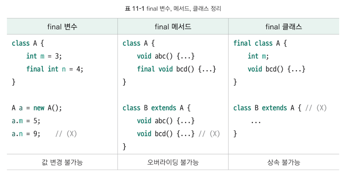

# 6주차 과제: 상속

# 목표

자바의 상속에 대해 학습하세요.

# 학습할 것 (필수)

* 자바 상속의 특징
* super 키워드
* 메소드 오버라이딩
* 다이나믹 메소드 디스패치 (Dynamic Method Dispatch)
* 추상 클래스
* final 키워드
* Object 클래스

# 자바 상속의 특징

## 장점

* 코드의 **중복성** 제거
* **다형적** 표현이 가능

## 단점

* 부모 클래스가 바뀌면 자식 클래스도 다 바뀐다.
* 컴파일 시에 모든 상속이 결정되버린다.

---
[상속과 합성에 대해 보면 좋은 글](https://june0122.github.io/2021/08/21/design-pattern-delegate/)

# super 키워드

> `this`는 자기 객체를 가리키는 참조 변수명, `super`는 부모 객체를 가리키는 참조 변수명

필드명의 중복 또는 메소드 오버라이딩으로 가려진 부모의 필드 또는 메소드를 호출하기 위해 사용.

또는, 부모 클래스의 생성자를 호출할 때는 `super()` 메소드를 사용.

클래스 `A`를 상속받아 클래스 B를 생성하고, `B()` 생성자를 이용해 객체를 생성할 때는 부모 클래스가 먼저 생성됨.
이 때 호출되는 생성자가 `super()` -> 부모 클래스의 생성자를 호출한다.

`this()`와 마찬가지로 **생성자의 내부에서만 사용할 수 있고, 반드시 첫 줄에 와야한다.**

> 여기서 매우 중요한 사실은 모든 생성자의 첫 줄에는 반드시 `this()` 또는 `super()`가 있어야 한다.
> 만일 아무것도 써 주지 않으면 컴파일러는 `super()`를 자동으로 삽입한다.

```java
class A {
    A(int a) {
        System.out.println("A 생성자");
    }
}

class B extends A {
    // 이렇게 되면 오류 발생
}
```

# 메소드 오버라이딩

> 부모 클래스에게 상속받은 메소드와 동일한 이름의 메소드를 재정의하는 것.

오버라이딩이 수행되기 위한 2가지 조건
---

1. 부모 클래스의 메소드와 시그니처 및 리턴 타입이 동일해야 한다.
2. 부모 클래스의 메소드보다 접근 지정자의 범위가 같거나 넓어야 한다.

메소드 오버라이딩과 오버로딩
---
오버로딩은 이름이 동일하지만, **시그니처가 다른 여러 개의 메소드를 같은 공간에 정의하는 것**

오버라이딩은 **이름과 시그니처가 동일한 메소드를 재정의하는 것**

# 다이나믹 메소드 디스패치 (Dynamic Method Dispatch)

> 런타임 시에 어떤 메소드를 호출할 지 결정하는 것

예를 들어 `Human` 이라는 클래스가 있고, 그것을 상속받은 클래스 `Student` `Artist` 클래스가 각각 있다고 가정하겠다.
`Human` 클래스 내부에는 `doSomething()` 이라는 메소드가 존재하고, 각각의 하위 클래스들에서는 이 메소드를 재정의하였다고 할 때,

이러한 코드가 가능해진다.

```java
public class JavaTest {
    Human student = new Student();
    Human artist = new Artist();
    
    student.doSomething();
    artist.doSomething();
}
```

위의 코드에서 `student` 라는 변수와 `artist` 라는 변수는 모두 `Human` 타입으로 받고 있다.
따라서 doSomething 메소드의 실제 구현은 런타임 시에 결정된다고 볼 수 있다.

[출처](https://velog.io/@maigumi/Dynamic-Method-Dispatch)

# 추상 클래스

> 추상 메소드를 1개 이상 포함하고 있는 클래스.
> 그러나 굳이 추상 메소드를 정의하지 않아도 클래스에 `abstract` 키워드만 적어주어도 추상 클래스로 정의할 수 있다.

여기서 추상 메소드란
> 메소드의 본체가 완성되지 않은 미완성 메소드n

를 뜻한다.

메소드의 기능을 정의하는 중괄호 자체가 없다.

```
abstract 리턴 타입 메소드명(입력매개변수);
```

```java
abstract class 클래스명 {

}
```

## 특징

추상 클래스는 내부의 미완성 메소드 때문에 객체를 직접 생성할 수 없다.
힙 메모리에 생성되는 객체는 내부 요소가 미완성된 상태로 들어갈 수 없기 때문이다.

추상클래스를 직접 생성할 수는 없지만 이 추상 클래스를 상속한 자식 클래스를 생성하면 그 자식 클래스로는 객체가 생성할 수 있다.
그리고 **그 객체 내부에는 부모 클래스의 추상 메소드가 반드시 구현돼 있어야 한다.**

# final 키워드

> final 키워드는 필드, 지역 변수, 메소드, 클래스 앞에 위치할 수 있다.
> 각각 어디에 위치하느냐에 따라 의미가 다르다.

## 변수

final 키워드는 변수 선언시에만 지정할 수 있으며, final 변수는 한 번 대입된 값을 수정할 수 없다.(한 번 대입된 값이 최종 값이 되는 셈)

## 메소드

메소드에 final 키워드를 붙이면 하위 클래스에서 메소드의 기능을 변경할 수 없게 제한시킨다.
즉, 메소드를 final 로 정의하면 자식 클래스에서 해당 메소드를 오버라이딩할 수 없다.

## 클래스

클래스에 final 키워드를 붙이면 더 이상 자식 클래스가 없다는 것을 의미한다. 따라서 final 클래스는 상속 자체가 아예 불가능하다.
JDK17부터는 특정 클래스에만 상속 시키고 나머지 클래스에는 final 클래스처럼 동작하는 [Sealed class](https://marrrang.tistory.com/82)라는 개념이 새로 생겼다.

## 정리



# Object 클래스

> 자바의 최상위 클래스이다. 모든 클래스는 Object 클래스를 상속받는다.

## Object 클래스의 주요 메소드

* toString(): String ->
    * Object 객체의 정보 `패키지.클래스명@해시코드`
* equals(obj: Object): boolean
    * 입력매개변수 obj 객체와 stack 메모리값(번지) 비교
    * 등가 비교 연산자 `==`와 동일한 결과
* hashCode(): int
    * 객체의 `hashCode()` 값 리턴. `Hashtable`, `HashMap` 등의 동등 비교에 사용
    * 위칫값을 기반으로 생성된 고윳값