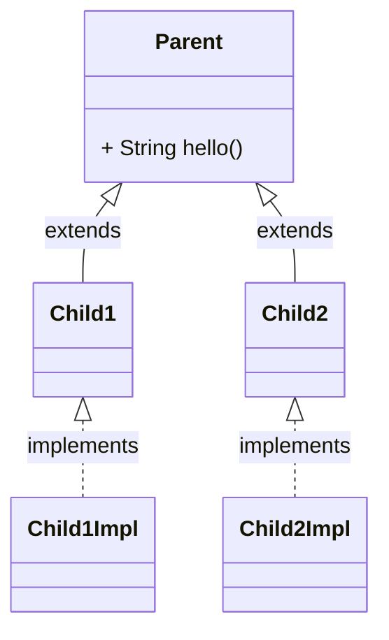
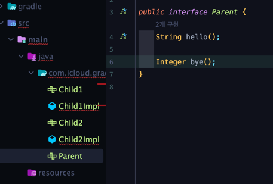
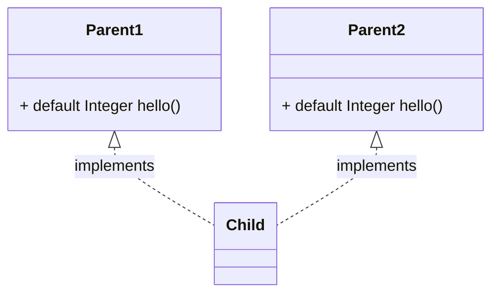

# 8주차 과제: 인터페이스

# 목표

자바의 인터페이스에 대해 학습하세요.

# 학습할 것 (필수)

* 인터페이스 정의하는 방법
* 인터페이스 구현하는 방법
* 인터페이스 레퍼런스를 통해 구현체를 사용하는 방법
* 인터페이스 상속
* 인터페이스의 기본 메소드 (Default Method), 자바 8
* 인터페이스의 static 메소드, 자바 8
* 인터페이스의 private 메소드, 자바 9

# 인터페이스 정의하는 방법

인터페이스
---

* 내부의 모든 필드가 `public static final` 로 정의.
* `static` 과 `default` 이외의 모든 메소드는 `public abstract`로 정의됨.
* `class` 키워드 대신에 `interface` 키워드를 사용해 선언

인터페이스 구조
---

기본적으로 인터페이스는 아래와 같은 방식으로 정의하게 된다.

```java
public interface A {
    int a = 3;

    void abc();
} 
```

이런 방식으로 정의되었을 떄, 바이트코드로 변환해보면 내부에서는 이런 식으로 변환된다.

```java
// class version 61.0 (61)
// access flags 0x601
public abstract interface com/icloud/gradle/A{

    // compiled from: A.java
    
    // access flags 0x19
    public final static I a=3
    
    // access flags 0x401
    public abstract abc()V
}

```

* 인터페이스 내부에 정의한 필드는 `public static final` 로 변환
* 인터페이스 내부에 정의한 메소드는 `abstract` 로 변환

그럼 위 예제에서 `A` 라는 인터페이스 안에 정의된 `a` 라는 필드는 `static` 키워드로 정의(변환)되었기 때문에
클래스명으로 바로 접근할 수 있다는 의미가 된다.

또한, `final` 키워드가 붙었기 때문에 값이 입력되었으면 다시는 값을 변경할 수 없다는 뜻이 된다.


---

# 인터페이스 구현하는(상속) 방법

인터페이스 상속
---

클래스가 클래스를 상속 시에는 `extends` 키워드를,<br/>
클래스가 인터페이스를 상속할 때는 `implements` 키워드를 사용한다.

인터페이스의 가장 큰 특징은 **다중 상속이 가능**하다는 것이다.

```java
클래스명 implements 인터페이스명, ..., 인터페이스명 {
    // 내용
}
```

다중 상속이 가능한 이유
---

기존 클래스에서 다중 상속이 불가능했던 이유는 두 부모 클래스에 동일한 이름의 필드 메소드가 존재할 때 이를 내려받으면 충돌이 발생했기 때문.

하지만 인터페이스에서는 모든 필드가 `public static final` 로 정의돼 있어 실제 데이터값은 
각각의 인터페이스 내부에 존재해 공간상 겹치지 않음.

또한, 메소드 자체가 아직 미완성이라 상속 받는 클래스 내부에서 완성할 것이므로 문제될 여지는 없다.

인터페이스 상속 방법
---
```java
interface A {
    void abc();
}

class B implements A {
    // -> 오류 발생
} 
```

인터페이스를 상속받음과 동시에 컴파일 에러가 발생한다. 인터페이스 내부의 미완성 메소드가 클래스 내부에 포함되기 때문이다.

```java
interface A {
    void abc();
}

class B implements A {
    @Override
    public void abc() {
        // -> 오류 발생 안함.
    }
}
```
위와 같이 상속받고나서 인터페이스의 미완성 메소드를 완성시켜줘야 문법 오류를 피할 수 있다.

> 자식 클래스에서 부모 인터페이스의 추상 메소드를 부모 메소드의 접근 제어자보다 작게 구현한 경우에는 컴파일 에러가 발생한다.

# 인터페이스 레퍼런스를 통해 구현체를 사용하는 방법

> OOP<sup>Object Oriented Programming</sup>의 특징을 활용하여 
> 인터페이스 타입으로 선언한 변수에 구현체 인스턴스를 할당할 수 있다.

이렇게 인터페이스의 레퍼런스를 활용하여 구현체를 사용하면 다음과 같은 장점을 얻을 수 있다.

**OCP**<sup>Open Closed Principal</sup> 원칙을 지킬 수 있다.
   * 해당 구현체를 사용하는 클라이언트 코드에서는 어떤 형식으로 구현했는지 
   전혀 신경쓰지 않아도 되기 때문에 확장에는 열려있고 변경에는 닫혀있는 형태의 프로그래밍이 가능핟.

# 인터페이스 상속

> 인터페이스는 클래스에만 상속할 수 있는 것이 아니라 같은 인터페이스끼리도 상속할 수 있다.

상속은 다음과 같이 정리할 수 있다.

* 클래스가 클래스를 상속받을 때 : `extends`
* 클래스가 인터페이스를 상속받을 때 : `implements`
* 인터페이스가 인터페이스를 상속받을 때 : `extends`

인터페이스가 인터페이스를 상속할 때는 `extends` 키워드를 사용한다.

---

# 인터페이스의 기본 메소드 (Default Method), 자바 8

> Java 8에 새로 추가된 문법 중에는 인터페이스 내부에 이미 완성된 메소드인 
> 디폴트<sup>`default`</sup> 메소드가 있다.

디폴트 메소드는 아래와 같이 메소드 시그니쳐의 반환 값 앞에 `default` 키워드를 붙여서 표기한다.

```java
interface SomeInterface {
   default hello() {
       // -> 구현할 메소드
   }
}
```

그렇다면 인터페이스의 기본 메소드는 왜 필요할까?
---

만약 `Parent` 라는 인터페이스가 있고 `Child1` `Child2` 인터페이스 가 각각 상속을 받고
또 `Child1` 클래스를 `Child1Impl`<br/>
`Child2` 클래스를 `Child2Impl` 클래스가 상속받고 있다고 해보자.



이런 구조에서 `Parent` 인터페이스의 `hello()` 추상 메소드 이외에 또다른 추상 메소드가 추가되면
해당 인터페이스를 구현하고 있는 모든 클래스에 컴파일 에러가 발생한다.



이러한 현상을 방지하고자 자바에서는 `default 메소드` 가 추가되었다.

> 그래도 인터페이스 내에 완성된 메소드인 `default 메소드` 는 완성된 형태이긴 하지만,<br/> 
> 인터페이스 자체가 객체를 생성할 수 없는 상태이므로 해당 `default 메소드` 를 실행사키기 위해서는 일단 상속시켜야 한다.

여기서 한가지 의문이 든다. 만약 자식 클래스가 2개의 부모 인터페이스를 상속 받고, 각각의 부모 인터페이스들은 
메소드 이름 및 시그니쳐가 똑같은 `default 메소드` 를 소유하고 있다면 어떻게 될까?

아래와 같은 구조로 클래스를 생성해보았다.



이런 식으로 만들게 되면 Java는 아래와 같은 컴파일 에러를 내뿜는다.
```
error: types Parent1 and Parent2 are incompatible;
public class Child implements Parent1, Parent2 {
       ^
  class Child inherits unrelated defaults for hello() from types Parent1 and Parent2
```

이러한 현상을 해결하려면 `Child` 클래스에서 `Parent1` 과 `Parent2`에 있는 `hello()` 메소드를 재정의해야 한다.

```java
public class Child implements Parent1, Parent2 {

    @Override
    public Integer hello() {
        return Parent1.super.hello();
    }
    
}
```

일반 클래스에서는 부모 클래스를 호출할 때 단순히 `super` 라는 키워드만 쓰지만 인터페이스는 `super` 앞에 인터페이스명까지 붙는 형식이다.<br/>
이는 인터페이스를 다중 상속 받을 경우 어떤 부모인 `super`를 지칭하는지 구분하기 위해서이다.
---

# 인터페이스의 static 메소드, 자바 8

> 자바 8 이후부터는 인터페이스에 `static` 메소드를 포함할 수 있게 되었다.

클래스 내부의 정적 메소드와 동일한 기능이다. 그렇기 때문에 객체를 생성하지 않고도 `인터페이스명.정적메소드명` 으로 호출할 수 있다.

---


# 인터페이스의 private 메소드, 자바 9

> 자바 9부터는 인터페이스 내부에서만 사용하는 기능을 `private` 로 숨길 수 있다.

이러한 `private 메소드는` 자식 클래스들에 공개되지 않고 내부에서만 사용할 수 있다. 자바 8 이후에 인터페이스가 자체 메소드를 가질 수 있게 되었고(`default`)<br/>
이로 인해 반복되는 코드가 생길 수 있으니 내부에서만 사용할 비공개 메소드가 필요해졌다.