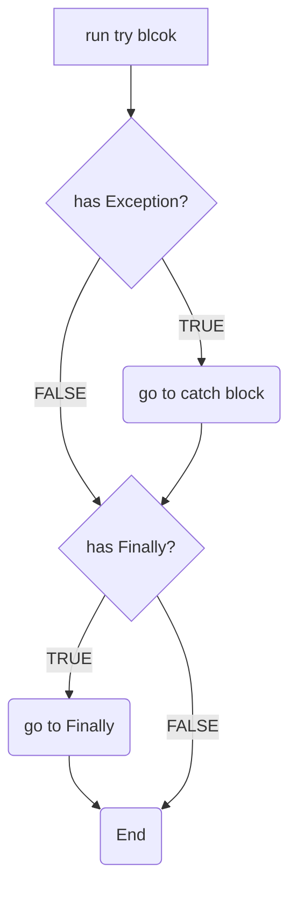
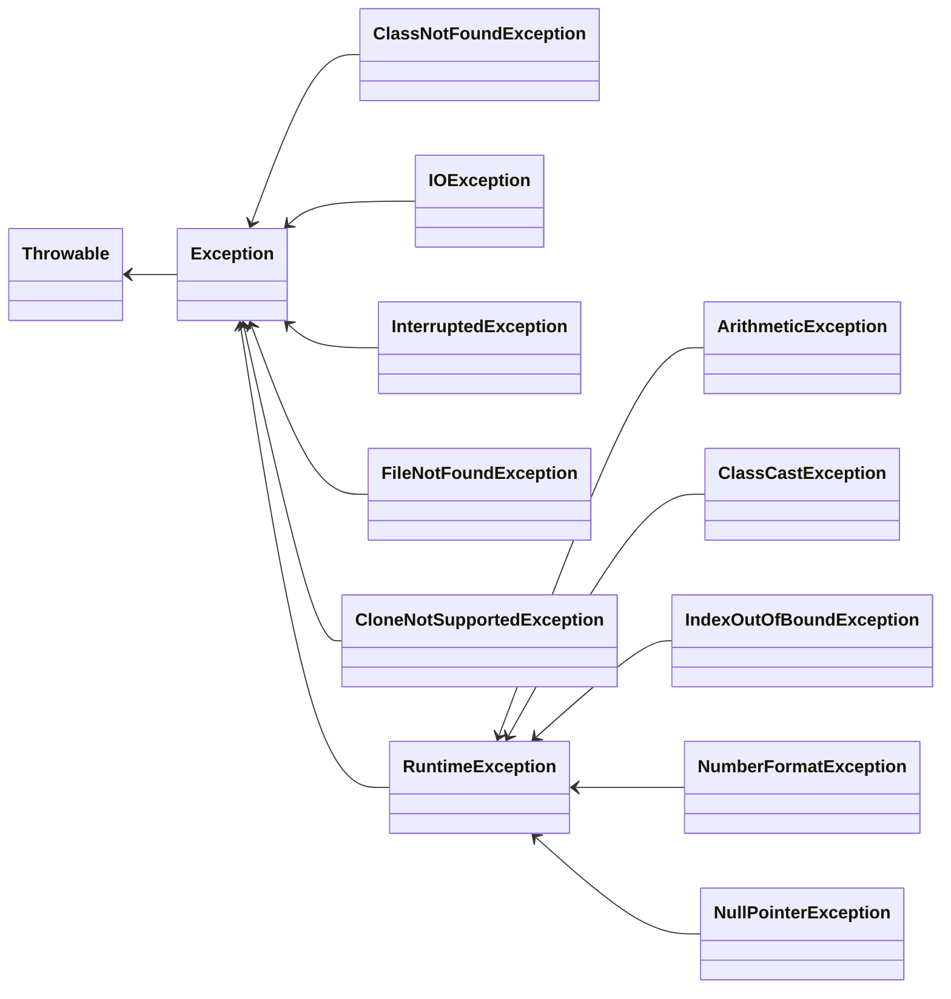

# 9주차 과제: 예외처리

# 목표

자바의 예외 처리에 대해 학습하세요.

# 학습할 것 (필수)

* 자바에서 예외 처리 방법 (try, catch, throw, throws, finally)
* 자바가 제공하는 예외 계층 구조
* Exception과 Error의 차이는?
* RuntimeException과 RE가 아닌 것의 차이는?
* 커스텀한 예외 만드는 방법

# 자바에서 예외 처리 방법 (try, catch, throw, throws, finally)

## 자바에서의 예외 문법

```java
public class JavaTest {
    public static void main(String[] args) {
        try {
            // 일반 예외 혹은 실행 예외 발생 가능성이 있는 코드
            System.out.println(someException());
        } catch (Exception e) {
            // 예외가 발생했을 경우 수행할 코드
            System.out.println("예외 발생!!");
        } finally {
            // 예외 발생을 했건 안했건 무조건 실행
            System.out.println("예외가 발생했기 때문에 프로그램을 종료합니다.");
            System.exit(0);
        }
    }

    private static void someException() {
        throw new Exception();
    }
}
```

> 예외 처리 문법은 크게 3가지 요소(try, catch, finally) 로 구성되어 있다.


try{}
---
예외가 발생할 수 있는 코드를 작성한다.

catch{}
---
catch의 소괄호 안의 예외 타입에 해당하는 예외를 처리하는 코드를 작성한다.

finally{}
---
예외가 발생하든, 발생하지 않든 항상 실행되는 코드를 작성한다.

## 예외 처리 과정



1. `try{}` 구문 실행
2. 예외 발생?
    1. 발생한다면 `catch(){}`은 실행 X
3. `finally{}` 블록 존재?
    1. 있다면 `finally{}` 블록 실행

try 블록 내에서 예외 발생 시 JVM이 가장 먼저 인지.

JVM은 발생한 예외 타입 객체 생성 후 `catch(){}` 블록의 매개변수로 전달

### 여러개의 예외 처리

자바는 하나의 `try{}` 구문에 대해 여러 개의 `catch(){}`를 추가할 수 있다.

```java
public class JavaTest {
    public static void main(String[] args) {
        try {

        } catch (Exception1 e1) {

        } catch (Exception2 e2) {

        } catch (Exception3 e3) {
            //... 
        } finally {
            //...
        }
    }
}
```

여기서 주의해야 할 점은, `catch는 위에서부터 아래로` 차례대로 찾기 시작하며 만약 아래의 `catch(){}`에서 정의한 예외타입이
위에서 정의한 예외타입보다 하위타입이라면 해당 블록은 절대 도달할 수 없는 코드가 된다.

---

# 자바가 제공하는 예외 계층 구조

> 자바 예외의 최상위 클래스는 `Exception` 클래스이다. 에러의 최상위 클래스는 `Error` 클래스이다.
> 이들은 모두 `Throwable` 클래스를 상속받고 있다.



일반 예외<sup>checked exception</sup>
---

> `Exception` 클래스에게서 직접 상속 받은 예외 클래스.

컴파일 전에 예외 발생 문법을 검사하며 예외 처리를 하지 않으면 문법 오류로 간주.

실행 예외<sup>RuntimeException</sup>
---

> `Exception` 클래스를 상속 받은 `RuntimeException` 클래스를 상속받은 예외 클래스.

예외 처리를 따로 하지 않더라도 문법 오류가 발생하지 않는다.
`일반 예외`처럼 컴파일 전에 검사를 하지 않기 때문에, 세심한 주의가 필요하다.

---

# Exception과 Error의 차이는?

> `Exception`은 개발자가 해결할 수 있는 오류, `Error`은 개발자가 해결할 수 없는 오류를 일컫는다.


Exception
---
연산 오류나 숫자 포맷 오류 등과 같이 코드 상의 오류로 인해 개발자가 차선책을 제시할 수 있음.

Error
---
JVM 자체에서(예를 들어 메모리가 가득 찼을 떄...) 발생하는 오류로 개발자가 해결을 할 수 없음.

---

# RuntimeException과 RE가 아닌 것의 차이는?

> `Unchecked Exception`을 직접적으로 상속받는 예외 클래스를 제외하고는 나머지 `Exception` 클래스를 상속받는 예외 클래스들은
> `Checked Exception`이다.

위에서 설명한 것처럼 Checked Exception은 컴파일 전에 전에 문법 검사를 하기 때문에 예외에 대한 처리가 필요하다.

Unchecked Exception은 컴파일 전에 문법 검사를 하지 않기 때문에 예외 처리가 강제되지 않는다. 위의 설명에서 다뤘기 때문에 넘어가겠다.

# 커스텀한 예외 만드는 방법

> 자바의 기본 예외 클래스들과 마찬가지로 `Exception` 클래스를 바로 상속해서 일반 예외로 만들거나,
> `RuntimeException`을 상속해서 실행 예외 클래스로 만들 수 있다.

```java
/**
 * 사용자 정의 일반 예외를 만드는 경우
 */
public class CustomException extends Exception {
    CustomException() {
    }

    CustomException(String message) {
        super(message);
    }
}

/**
 * 사용자 정의 실행 예외를 만드는 경우
 */
public class CustomRuntimeException extends RuntimeExecption {
    CustomRuntimeException() {
    }

    CustomRuntimeException(String message) {
        super(message);
    }
}
```